# Diagramas Mermaid do Sistema S.O.L.

Arquivos gerados para complementar a documentação do projeto **S.O.L. — Sistema de Ocupação de Locais**.

Critério adotado: os diagramas foram baseados nos casos de uso, dicionário de classes e regras descritas no arquivo `PlanodoProjeto (1).md`. Para os diagramas de estados e atividades, foi seguido o padrão do grupo de referência: selecionar classes diretamente envolvidas em cada UC e detalhar o estado/atividade principal relacionado ao fluxo do caso de uso.


# Diagramas de Comunicação por Caso de Uso

> Observação: Mermaid não possui um tipo nativo específico para diagrama UML de comunicação. Por isso, os diagramas abaixo usam `flowchart LR`, com mensagens numeradas entre objetos, representando o mesmo encadeamento de colaboração.

---

## Figura C1. Diagrama de Comunicação para o [UC001] Autenticação de Usuário

```mermaid
flowchart LR
    Usuario["<<ator>><br/>Usuário"]
    LoginPage["LoginPage"]
    AuthService["AuthService"]
    UsuarioController["UsuarioController"]
    AuthManager["AuthenticationManager"]
    UsuarioService["UsuarioService"]
    UsuarioRepo[(UsuarioRepository)]
    JwtUtil["JwtUtil"]
    Banco[(Banco de Dados)]

    Usuario -->|1: inserir email e senha| LoginPage
    LoginPage -->|2: solicitarLogin(LoginDTO)| AuthService
    AuthService -->|3: POST /login| UsuarioController
    UsuarioController -->|4: autenticar credenciais| AuthManager
    AuthManager -->|5: validar usuário| UsuarioService
    UsuarioService -->|6: buscar por email| UsuarioRepo
    UsuarioRepo --> Banco
    UsuarioRepo -->|7: retornar usuário| UsuarioService
    UsuarioService -->|8: retornar validação| AuthManager
    AuthManager -->|9: autenticação válida| UsuarioController
    UsuarioController -->|10: gerar token| JwtUtil
    JwtUtil -->|11: retornar JWT| UsuarioController
    UsuarioController -->|12: retornar AuthTokenDTO| AuthService
    AuthService -->|13: armazenar token| LoginPage
    LoginPage -->|14: redirecionar conforme perfil| Usuario
```

---

## Figura C2. Diagrama de Comunicação para o [UC002] Realizar Reserva de Sala para um Dia

```mermaid
flowchart LR
    Usuario["<<ator>><br/>Professor / Tutor"]
    MapaPage["MapaPage"]
    MapaComponent["MapaComponent"]
    Modal["ModalReservaComponent"]
    SalaApi["SalaApiService"]
    ReservaApi["ReservaApiService"]
    SalaController["SalaController"]
    ReservaController["ReservaController"]
    SalaService["SalaService"]
    ReservaService["ReservaService"]
    SalaRepo[(SalaRepository)]
    ReservaRepo[(ReservaRepository)]
    Banco[(Banco de Dados)]

    Usuario -->|1: buscar sala disponível| MapaPage
    MapaPage -->|2: repassar filtros| MapaComponent
    MapaComponent -->|3: consultar disponibilidade| SalaApi
    SalaApi -->|4: GET salas disponíveis| SalaController
    SalaController -->|5: validar filtros| SalaService
    SalaService -->|6: buscar salas| SalaRepo
    SalaService -->|7: buscar reservas existentes| ReservaRepo
    SalaRepo --> Banco
    ReservaRepo --> Banco
    SalaService -->|8: retornar disponibilidade| MapaComponent
    Usuario -->|9: selecionar sala e horário| Modal
    Modal -->|10: enviar ReservaDTO diária| ReservaApi
    ReservaApi -->|11: POST reserva diária| ReservaController
    ReservaController -->|12: criar reserva| ReservaService
    ReservaService -->|13: verificar permiteReserva| SalaRepo
    ReservaService -->|14: verificar conflito| ReservaRepo
    ReservaService -->|15: salvar status APROVADA| ReservaRepo
    ReservaRepo --> Banco
    ReservaController -->|16: retornar confirmação| Modal
    Modal -->|17: exibir reserva confirmada| Usuario
```

---

## Figura C3. Diagrama de Comunicação para o [UC003] Realizar Reserva Definitiva/Semestral

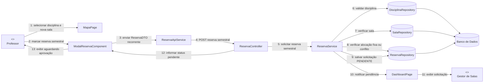

---

## Figura C4. Diagrama de Comunicação para o [UC004] Aprovar Solicitações do Sistema

```mermaid
flowchart LR
    Gestor["<<ator>><br/>Gestor de Salas"]
    Dashboard["DashboardPage"]
    Card["CardSolicitacaoComponent"]
    ReservaApi["ReservaApiService"]
    ProjetoApi["ProjetoApiService"]
    ReservaController["ReservaController"]
    ProjetoController["ProjetoController"]
    ReservaService["ReservaService"]
    ProjetoService["ProjetoService"]
    ReservaRepo[(ReservaRepository)]
    ProjetoRepo[(ProjetoRepository)]
    Banco[(Banco de Dados)]

    Gestor -->|1: acessar painel de solicitações| Dashboard
    Dashboard -->|2: listar pendências| Card
    Card -->|3a: carregar reservas pendentes| ReservaApi
    Card -->|3b: carregar projetos pendentes| ProjetoApi
    ReservaApi -->|4a: GET reservas pendentes| ReservaController
    ProjetoApi -->|4b: GET projetos pendentes| ProjetoController
    ReservaController -->|5a: consultar pendentes| ReservaService
    ProjetoController -->|5b: consultar pendentes| ProjetoService
    ReservaService --> ReservaRepo
    ProjetoService --> ProjetoRepo
    ReservaRepo --> Banco
    ProjetoRepo --> Banco
    Gestor -->|6: aprovar ou rejeitar solicitação| Card
    Card -->|7a: atualizar reserva| ReservaApi
    Card -->|7b: atualizar projeto| ProjetoApi
    ReservaApi -->|8a: PUT status reserva| ReservaController
    ProjetoApi -->|8b: PUT status projeto| ProjetoController
    ReservaController -->|9a: alterar status| ReservaService
    ProjetoController -->|9b: alterar aprovação| ProjetoService
    ReservaService -->|10a: salvar APROVADA ou REJEITADA| ReservaRepo
    ProjetoService -->|10b: salvar aprovado ou rejeitado| ProjetoRepo
    Card -->|11: exibir resultado| Gestor
```

---

## Figura C5. Diagrama de Comunicação para o [UC005] Visualizar Grade de Horários

```mermaid
flowchart LR
    Usuario["<<ator>><br/>Usuário"]
    MapaPage["MapaPage"]
    Filtro["FiltroBarraComponent"]
    Mapa["MapaComponent"]
    Calendario["CalendarioComponent"]
    SalaApi["SalaApiService"]
    SalaController["SalaController"]
    SalaService["SalaService"]
    SalaRepo[(SalaRepository)]
    ReservaRepo[(ReservaRepository)]
    ProjetoRepo[(ProjetoRepository)]
    Banco[(Banco de Dados)]

    Usuario -->|1: acessar mapa de salas| MapaPage
    MapaPage -->|2: abrir barra de filtros| Filtro
    Usuario -->|3: informar bloco, dia, horário ou projeto| Filtro
    Filtro -->|4: enviar FiltroMapaDTO| Mapa
    Mapa -->|5: buscar grade filtrada| SalaApi
    SalaApi -->|6: GET grade de horários| SalaController
    SalaController -->|7: consultar disponibilidade| SalaService
    SalaService -->|8: buscar salas| SalaRepo
    SalaService -->|9: buscar reservas| ReservaRepo
    SalaService -->|10: buscar projeto quando filtrado| ProjetoRepo
    SalaRepo --> Banco
    ReservaRepo --> Banco
    ProjetoRepo --> Banco
    SalaService -->|11: retornar ocupações| SalaController
    SalaController -->|12: retornar dados da grade| SalaApi
    SalaApi -->|13: atualizar estado do mapa| Mapa
    Mapa -->|14: renderizar eventos| Calendario
    Calendario -->|15: exibir grade| Usuario
```

---

## Figura C6. Diagrama de Comunicação para o [UC006] Registrar Projeto

```mermaid
flowchart LR
    Usuario["<<ator>><br/>Professor / Gestor"]
    ProjetoPage["ProjetoPage"]
    FormProjeto["FormProjetoComponent"]
    ProjetoApi["ProjetoApiService"]
    ProjetoController["ProjetoController"]
    ProjetoService["ProjetoService"]
    UsuarioRepo[(UsuarioRepository)]
    ProjetoRepo[(ProjetoRepository)]
    Dashboard["DashboardPage"]
    Banco[(Banco de Dados)]
    Gestor["<<ator>><br/>Gestor de Salas"]

    Usuario -->|1: acessar registrar projeto| ProjetoPage
    ProjetoPage -->|2: abrir formulário| FormProjeto
    Usuario -->|3: preencher nome, descrição, envolvidos e categoria| FormProjeto
    FormProjeto -->|4: enviar ProjetoDTO| ProjetoApi
    ProjetoApi -->|5: POST projeto| ProjetoController
    ProjetoController -->|6: registrar projeto| ProjetoService
    ProjetoService -->|7: validar tutor responsável| UsuarioRepo
    ProjetoService -->|8: salvar projeto pendente| ProjetoRepo
    UsuarioRepo --> Banco
    ProjetoRepo --> Banco
    ProjetoService -->|9: notificar nova solicitação| Dashboard
    Dashboard -->|10: apresentar pendência| Gestor
    ProjetoController -->|11: retornar status PENDENTE| ProjetoApi
    ProjetoApi -->|12: exibir confirmação| FormProjeto
    FormProjeto -->|13: informar aguardando aprovação| Usuario
```

---

## Figura C7. Diagrama de Comunicação para o [UC007] Gerenciar Sala e Atividades de Projeto

```mermaid
flowchart LR
    Integrante["<<ator>><br/>Tutor / Aluno de Projeto"]
    ProjetoPage["ProjetoPage"]
    Modal["ModalReservaComponent"]
    ProjetoApi["ProjetoApiService"]
    ReservaApi["ReservaApiService"]
    ProjetoController["ProjetoController"]
    ReservaController["ReservaController"]
    ProjetoService["ProjetoService"]
    ReservaService["ReservaService"]
    MembroRepo[(MembroProjetoRepository)]
    ProjetoRepo[(ProjetoRepository)]
    ReservaRepo[(ReservaRepository)]
    Banco[(Banco de Dados)]

    Integrante -->|1: acessar painel do projeto| ProjetoPage
    ProjetoPage -->|2: carregar projeto atual| ProjetoApi
    ProjetoApi -->|3: GET projeto| ProjetoController
    ProjetoController -->|4: consultar projeto| ProjetoService
    ProjetoService --> ProjetoRepo
    ProjetoRepo --> Banco
    Integrante -->|5: selecionar agendar atividade| Modal
    Modal -->|6: informar horário, título e visibilidade| ReservaApi
    ReservaApi -->|7: POST atividade do projeto| ReservaController
    ReservaController -->|8: registrar atividade| ReservaService
    ReservaService -->|9: validar integrante do projeto| MembroRepo
    ReservaService -->|10: validar sala exclusiva do projeto| ProjetoRepo
    ReservaService -->|11: verificar conflito na sala| ReservaRepo
    MembroRepo --> Banco
    ReservaRepo --> Banco
    ReservaService -->|12: salvar atividade pública ou privada| ReservaRepo
    ReservaController -->|13: retornar atividade registrada| ReservaApi
    ReservaApi -->|14: atualizar painel do projeto| ProjetoPage
    ProjetoPage -->|15: exibir programação atualizada| Integrante
```

---

## Figura C8. Diagrama de Comunicação para o [UC008] Gerenciar Horários Livres dos Integrantes

```mermaid
flowchart LR
    Integrante["<<ator>><br/>Integrante do Projeto"]
    ProjetoPage["ProjetoPage"]
    Horarios["HorariosLivresComponent"]
    DispApi["DisponibilidadeApiService"]
    DispController["DisponibilidadeController"]
    DispService["DisponibilidadeService"]
    DispRepo[(DisponibilidadeRepository)]
    MembroRepo[(MembroProjetoRepository)]
    Banco[(Banco de Dados)]

    Integrante -->|1: acessar meus horários| ProjetoPage
    ProjetoPage -->|2: abrir componente de horários livres| Horarios
    Integrante -->|3: selecionar blocos disponíveis| Horarios
    Horarios -->|4: enviar DisponibilidadeDTO| DispApi
    DispApi -->|5: POST disponibilidade| DispController
    DispController -->|6: salvar disponibilidade| DispService
    DispService -->|7: validar membro do projeto| MembroRepo
    DispService -->|8: persistir horários livres| DispRepo
    DispService -->|9: consultar disponibilidades dos membros| DispRepo
    DispService -->|10: calcular interseção| DispService
    MembroRepo --> Banco
    DispRepo --> Banco
    DispController -->|11: retornar matriz consolidada| DispApi
    DispApi -->|12: atualizar interseção| Horarios
    Horarios -->|13: exibir horários comuns| Integrante
```

---

## Figura C9. Diagrama de Comunicação para o [UC009] Manter Usuários

```mermaid
flowchart LR
    Gestor["<<ator>><br/>Gestor de Salas"]
    GestaoUsuarios["GestaoUsuariosPage"]
    ApiClient["ApiClient"]
    UsuarioController["UsuarioController"]
    UsuarioService["UsuarioService"]
    UsuarioRepo[(UsuarioRepository)]
    Banco[(Banco de Dados)]

    Gestor -->|1: acessar gestão de usuários| GestaoUsuarios
    GestaoUsuarios -->|2: solicitar lista de usuários| ApiClient
    ApiClient -->|3: GET usuários| UsuarioController
    UsuarioController -->|4: listar usuários| UsuarioService
    UsuarioService -->|5: consultar registros| UsuarioRepo
    UsuarioRepo --> Banco
    UsuarioService -->|6: retornar lista| UsuarioController
    UsuarioController -->|7: retornar UsuarioDTO| ApiClient
    ApiClient -->|8: atualizar tabela| GestaoUsuarios
    Gestor -->|9: cadastrar, editar ou inativar usuário| GestaoUsuarios
    GestaoUsuarios -->|10: enviar operação CRUD| ApiClient
    ApiClient -->|11: POST PUT ou DELETE usuário| UsuarioController
    UsuarioController -->|12: processar manutenção| UsuarioService
    UsuarioService -->|13: salvar alteração| UsuarioRepo
    UsuarioRepo --> Banco
    UsuarioController -->|14: retornar resultado| GestaoUsuarios
    GestaoUsuarios -->|15: exibir atualização| Gestor
```

---

## Figura C10. Diagrama de Comunicação para o [UC010] Manter Salas

```mermaid
flowchart LR
    Gestor["<<ator>><br/>Gestor de Salas"]
    GestaoSalas["GestaoSalasPage"]
    SalaApi["SalaApiService"]
    SalaController["SalaController"]
    SalaService["SalaService"]
    SalaRepo[(SalaRepository)]
    ReservaRepo[(ReservaRepository)]
    Banco[(Banco de Dados)]

    Gestor -->|1: acessar inventário de salas| GestaoSalas
    GestaoSalas -->|2: carregar salas| SalaApi
    SalaApi -->|3: GET salas| SalaController
    SalaController -->|4: listar salas| SalaService
    SalaService -->|5: consultar salas| SalaRepo
    SalaRepo --> Banco
    Gestor -->|6: adicionar ou editar sala| GestaoSalas
    GestaoSalas -->|7: enviar dados da sala| SalaApi
    SalaApi -->|8: POST ou PUT sala| SalaController
    SalaController -->|9: validar dados e permissões| SalaService
    SalaService -->|10: verificar reservas quando necessário| ReservaRepo
    SalaService -->|11: salvar alteração| SalaRepo
    ReservaRepo --> Banco
    SalaRepo --> Banco
    SalaController -->|12: retornar resultado| SalaApi
    SalaApi -->|13: atualizar inventário| GestaoSalas
    GestaoSalas -->|14: exibir salas atualizadas| Gestor
```

---

## Figura C11. Diagrama de Comunicação para o [UC011] Manter Disciplinas

```mermaid
flowchart LR
    Gestor["<<ator>><br/>Gestor de Salas"]
    GestaoDisciplinas["GestaoDisciplinasPage"]
    ApiClient["ApiClient"]
    DisciplinaController["DisciplinaController"]
    DisciplinaService["DisciplinaService"]
    DisciplinaRepo[(DisciplinaRepository)]
    UsuarioRepo[(UsuarioRepository)]
    Banco[(Banco de Dados)]

    Gestor -->|1: acessar gestão de disciplinas| GestaoDisciplinas
    GestaoDisciplinas -->|2: carregar disciplinas| ApiClient
    ApiClient -->|3: GET disciplinas| DisciplinaController
    DisciplinaController -->|4: listar disciplinas| DisciplinaService
    DisciplinaService -->|5: consultar registros| DisciplinaRepo
    DisciplinaRepo --> Banco
    Gestor -->|6: cadastrar ou importar disciplina| GestaoDisciplinas
    GestaoDisciplinas -->|7: enviar DisciplinaDTO| ApiClient
    ApiClient -->|8: POST ou PUT disciplina| DisciplinaController
    DisciplinaController -->|9: processar manutenção| DisciplinaService
    DisciplinaService -->|10: validar professor| UsuarioRepo
    DisciplinaService -->|11: salvar disciplina| DisciplinaRepo
    UsuarioRepo --> Banco
    DisciplinaRepo --> Banco
    DisciplinaController -->|12: retornar resultado| ApiClient
    ApiClient -->|13: atualizar tabela| GestaoDisciplinas
    GestaoDisciplinas -->|14: exibir disciplinas atualizadas| Gestor
```

---

## Figura C12. Diagrama de Comunicação para o [UC012] Gerenciar Membros do Projeto

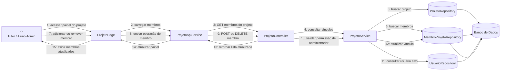
