# Diagramas Mermaid do Sistema S.O.L.

Arquivos gerados para complementar a documentação do projeto **S.O.L. — Sistema de Ocupação de Locais**.

Critério adotado: os diagramas foram baseados nos casos de uso, dicionário de classes e regras descritas no arquivo `PlanodoProjeto (1).md`. Para os diagramas de estados e atividades, foi seguido o padrão do grupo de referência: selecionar classes diretamente envolvidas em cada UC e detalhar o estado/atividade principal relacionado ao fluxo do caso de uso.

# Diagramas de Estados por Classe e Caso de Uso

---

## Figura E1. Diagrama de Estados da classe `LoginPage` para o [UC001]

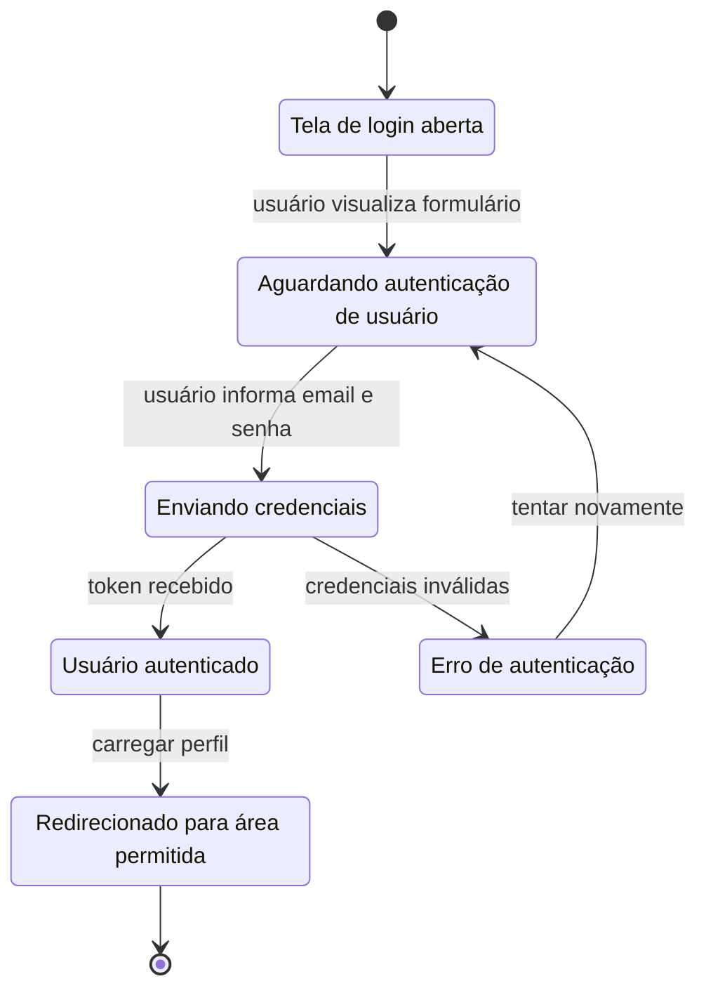
```mermaid
stateDiagram-v2
    [*] --> TelaLoginAberta
    TelaLoginAberta: Tela de login aberta
    TelaLoginAberta --> AguardandoAutenticacao: usuário visualiza formulário
    AguardandoAutenticacao: Aguardando autenticação de usuário
    AguardandoAutenticacao --> EnviandoCredenciais: usuário informa email e senha
    EnviandoCredenciais: Enviando credenciais
    EnviandoCredenciais --> Autenticado: token recebido
    EnviandoCredenciais --> ErroAutenticacao: credenciais inválidas
    ErroAutenticacao: Erro de autenticação
    ErroAutenticacao --> AguardandoAutenticacao: tentar novamente
    Autenticado: Usuário autenticado
    Autenticado --> Redirecionado: carregar perfil
    Redirecionado: Redirecionado para área permitida
    Redirecionado --> [*]
```

## Figura E2. Diagrama de Estados da classe `UsuarioController` para o [UC001]

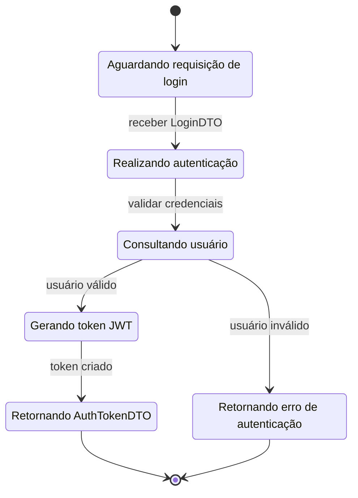
```mermaid
stateDiagram-v2
    [*] --> AguardandoRequisicaoLogin
    AguardandoRequisicaoLogin: Aguardando requisição de login
    AguardandoRequisicaoLogin --> RealizandoAutenticacao: receber LoginDTO
    RealizandoAutenticacao: Realizando autenticação
    RealizandoAutenticacao --> ConsultandoUsuario: validar credenciais
    ConsultandoUsuario: Consultando usuário
    ConsultandoUsuario --> GerandoToken: usuário válido
    ConsultandoUsuario --> RetornandoErro: usuário inválido
    GerandoToken: Gerando token JWT
    GerandoToken --> RetornandoToken: token criado
    RetornandoToken: Retornando AuthTokenDTO
    RetornandoErro: Retornando erro de autenticação
    RetornandoToken --> [*]
    RetornandoErro --> [*]
```

---

## Figura E3. Diagrama de Estados da classe `ModalReservaComponent` para o [UC002]

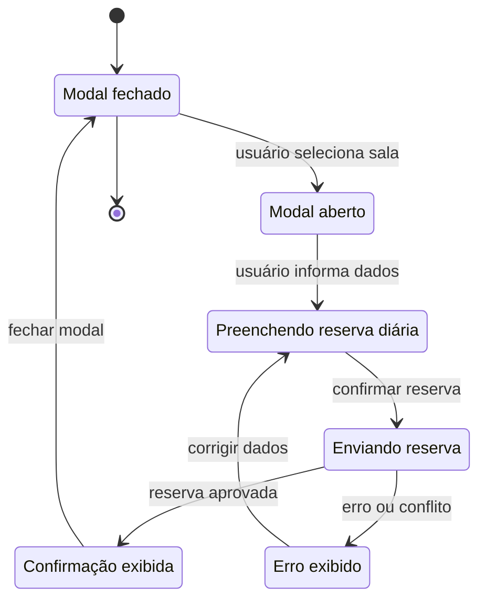
```mermaid
stateDiagram-v2
    [*] --> Fechado
    Fechado: Modal fechado
    Fechado --> Aberto: usuário seleciona sala
    Aberto: Modal aberto
    Aberto --> PreenchendoReservaDiaria: usuário informa dados
    PreenchendoReservaDiaria: Preenchendo reserva diária
    PreenchendoReservaDiaria --> EnviandoReserva: confirmar reserva
    EnviandoReserva: Enviando reserva
    EnviandoReserva --> ConfirmacaoExibida: reserva aprovada
    EnviandoReserva --> ErroExibido: erro ou conflito
    ErroExibido: Erro exibido
    ErroExibido --> PreenchendoReservaDiaria: corrigir dados
    ConfirmacaoExibida: Confirmação exibida
    ConfirmacaoExibida --> Fechado: fechar modal
    Fechado --> [*]
```

## Figura E4. Diagrama de Estados da classe `ReservaService` para o [UC002]

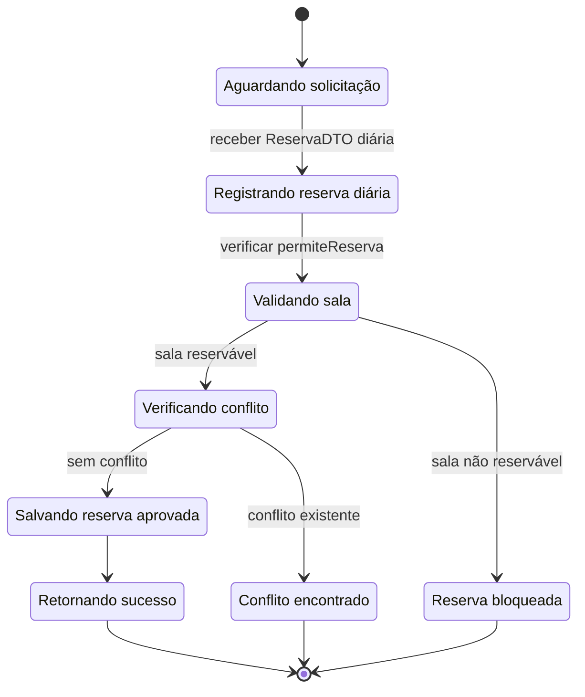
```mermaid
stateDiagram-v2
    [*] --> AguardandoSolicitacao
    AguardandoSolicitacao: Aguardando solicitação
    AguardandoSolicitacao --> RegistrandoReservaDiaria: receber ReservaDTO diária
    RegistrandoReservaDiaria: Registrando reserva diária
    RegistrandoReservaDiaria --> ValidandoSala: verificar permiteReserva
    ValidandoSala: Validando sala
    ValidandoSala --> VerificandoConflito: sala reservável
    ValidandoSala --> ReservaBloqueada: sala não reservável
    VerificandoConflito: Verificando conflito
    VerificandoConflito --> SalvandoAprovada: sem conflito
    VerificandoConflito --> ConflitoEncontrado: conflito existente
    SalvandoAprovada: Salvando reserva aprovada
    SalvandoAprovada --> RetornandoSucesso
    RetornandoSucesso: Retornando sucesso
    ReservaBloqueada: Reserva bloqueada
    ConflitoEncontrado: Conflito encontrado
    RetornandoSucesso --> [*]
    ReservaBloqueada --> [*]
    ConflitoEncontrado --> [*]
```

---

## Figura E5. Diagrama de Estados da classe `ModalReservaComponent` para o [UC003]

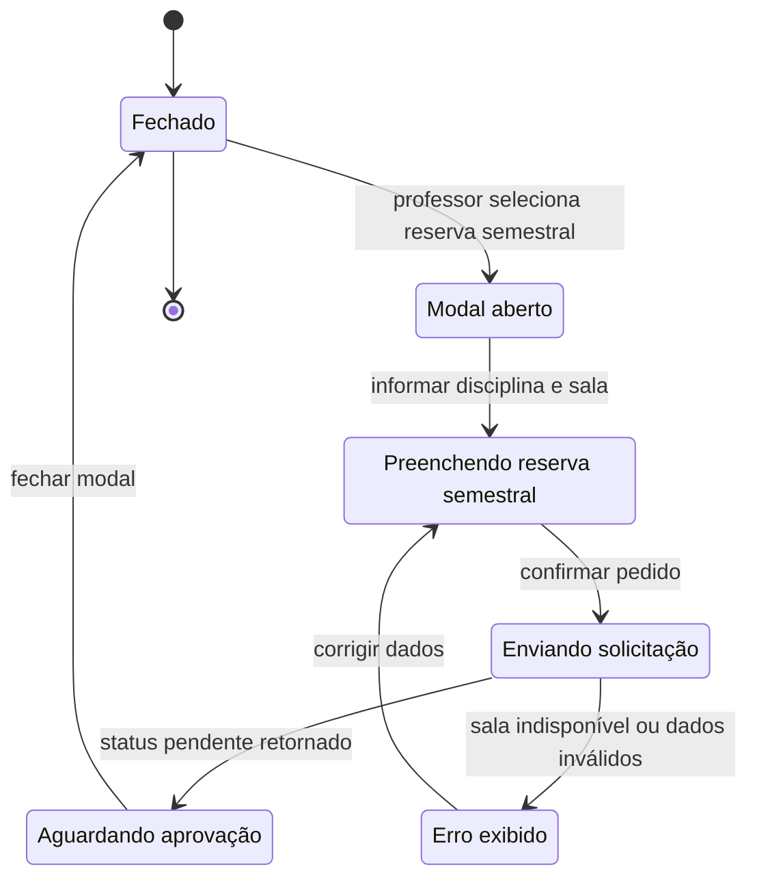
```mermaid
stateDiagram-v2
    [*] --> Fechado
    Fechado --> Aberto: professor seleciona reserva semestral
    Aberto: Modal aberto
    Aberto --> PreenchendoReservaSemestral: informar disciplina e sala
    PreenchendoReservaSemestral: Preenchendo reserva semestral
    PreenchendoReservaSemestral --> EnviandoSolicitacao: confirmar pedido
    EnviandoSolicitacao: Enviando solicitação
    EnviandoSolicitacao --> AguardandoAprovacao: status pendente retornado
    EnviandoSolicitacao --> ErroExibido: sala indisponível ou dados inválidos
    AguardandoAprovacao: Aguardando aprovação
    ErroExibido: Erro exibido
    ErroExibido --> PreenchendoReservaSemestral: corrigir dados
    AguardandoAprovacao --> Fechado: fechar modal
    Fechado --> [*]
```

## Figura E6. Diagrama de Estados da classe `ReservaService` para o [UC003]

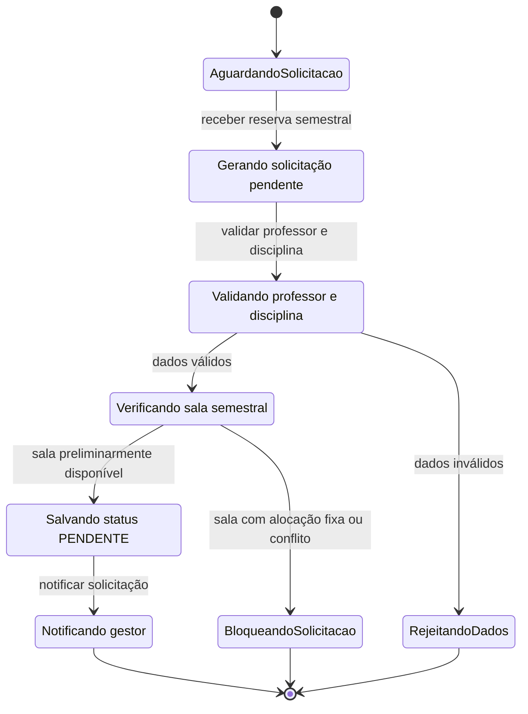
```mermaid
stateDiagram-v2
    [*] --> AguardandoSolicitacao
    AguardandoSolicitacao --> GerandoSolicitacaoPendente: receber reserva semestral
    GerandoSolicitacaoPendente: Gerando solicitação pendente
    GerandoSolicitacaoPendente --> ValidandoProfessorDisciplina: validar professor e disciplina
    ValidandoProfessorDisciplina: Validando professor e disciplina
    ValidandoProfessorDisciplina --> VerificandoSalaSemestral: dados válidos
    ValidandoProfessorDisciplina --> RejeitandoDados: dados inválidos
    VerificandoSalaSemestral: Verificando sala semestral
    VerificandoSalaSemestral --> SalvandoPendente: sala preliminarmente disponível
    VerificandoSalaSemestral --> BloqueandoSolicitacao: sala com alocação fixa ou conflito
    SalvandoPendente: Salvando status PENDENTE
    SalvandoPendente --> NotificandoGestor: notificar solicitação
    NotificandoGestor: Notificando gestor
    NotificandoGestor --> [*]
    RejeitandoDados --> [*]
    BloqueandoSolicitacao --> [*]
```

---

## Figura E7. Diagrama de Estados da classe `DashboardPage` para o [UC004]

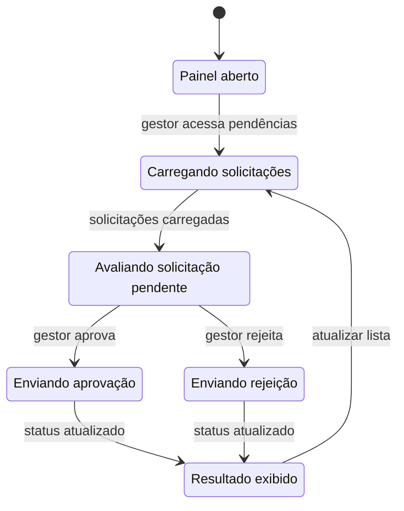
```mermaid
stateDiagram-v2
    [*] --> PainelAberto
    PainelAberto: Painel aberto
    PainelAberto --> CarregandoSolicitacoes: gestor acessa pendências
    CarregandoSolicitacoes: Carregando solicitações
    CarregandoSolicitacoes --> AvaliandoSolicitacaoPendente: solicitações carregadas
    AvaliandoSolicitacaoPendente: Avaliando solicitação pendente
    AvaliandoSolicitacaoPendente --> EnviandoAprovacao: gestor aprova
    AvaliandoSolicitacaoPendente --> EnviandoRejeicao: gestor rejeita
    EnviandoAprovacao: Enviando aprovação
    EnviandoRejeicao: Enviando rejeição
    EnviandoAprovacao --> ResultadoExibido: status atualizado
    EnviandoRejeicao --> ResultadoExibido: status atualizado
    ResultadoExibido: Resultado exibido
    ResultadoExibido --> CarregandoSolicitacoes: atualizar lista
```

## Figura E8. Diagrama de Estados da classe `ReservaService` para o [UC004]

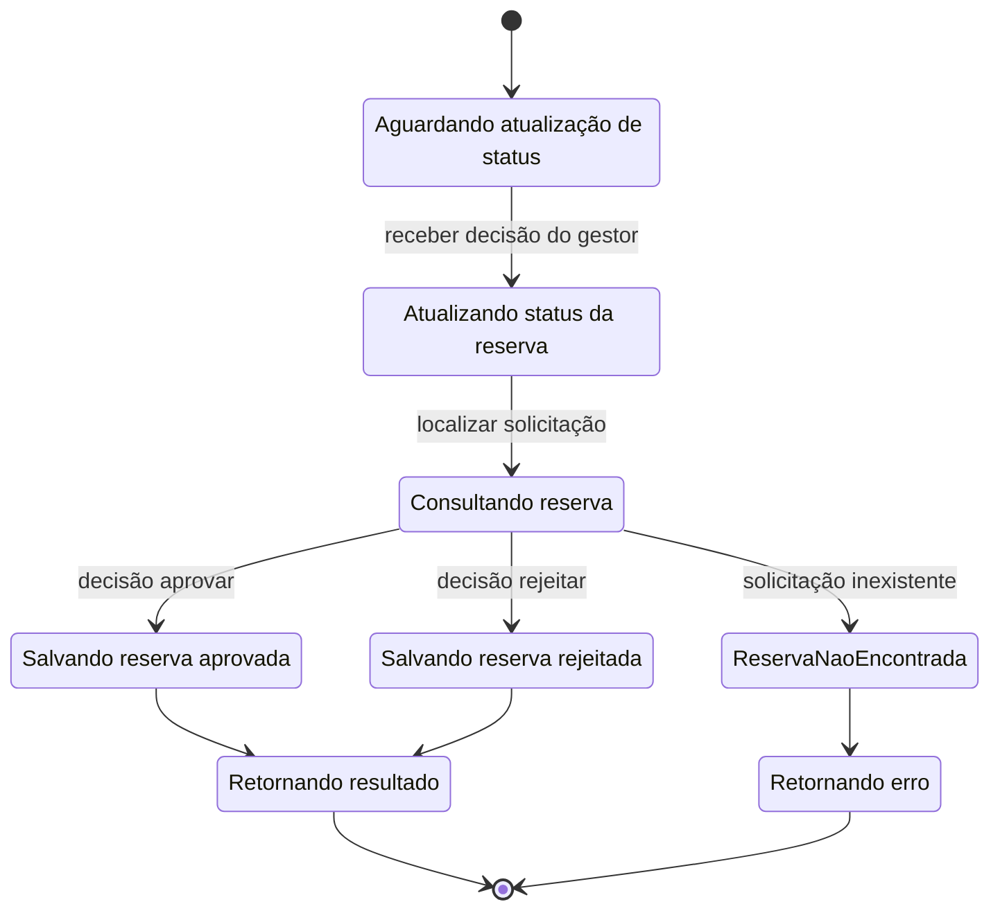
```mermaid
stateDiagram-v2
    [*] --> AguardandoAtualizacaoStatus
    AguardandoAtualizacaoStatus: Aguardando atualização de status
    AguardandoAtualizacaoStatus --> AtualizandoStatusReserva: receber decisão do gestor
    AtualizandoStatusReserva: Atualizando status da reserva
    AtualizandoStatusReserva --> ConsultandoReserva: localizar solicitação
    ConsultandoReserva: Consultando reserva
    ConsultandoReserva --> SalvandoAprovada: decisão aprovar
    ConsultandoReserva --> SalvandoRejeitada: decisão rejeitar
    ConsultandoReserva --> ReservaNaoEncontrada: solicitação inexistente
    SalvandoAprovada: Salvando reserva aprovada
    SalvandoRejeitada: Salvando reserva rejeitada
    SalvandoAprovada --> RetornandoResultado
    SalvandoRejeitada --> RetornandoResultado
    ReservaNaoEncontrada --> RetornandoErro
    RetornandoResultado: Retornando resultado
    RetornandoErro: Retornando erro
    RetornandoResultado --> [*]
    RetornandoErro --> [*]
```

## Figura E9. Diagrama de Estados da classe `ProjetoService` para o [UC004]

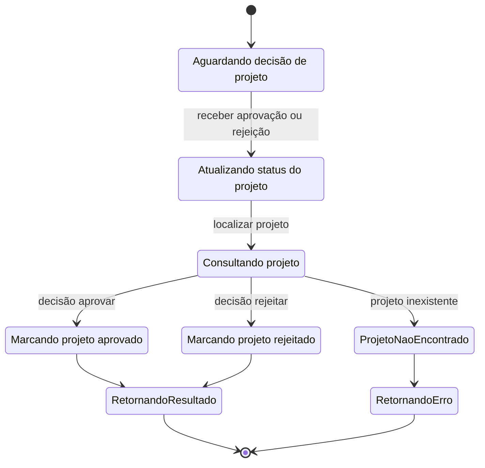
```mermaid
stateDiagram-v2
    [*] --> AguardandoDecisaoProjeto
    AguardandoDecisaoProjeto: Aguardando decisão de projeto
    AguardandoDecisaoProjeto --> AtualizandoStatusProjeto: receber aprovação ou rejeição
    AtualizandoStatusProjeto: Atualizando status do projeto
    AtualizandoStatusProjeto --> ConsultandoProjeto: localizar projeto
    ConsultandoProjeto: Consultando projeto
    ConsultandoProjeto --> MarcandoAprovado: decisão aprovar
    ConsultandoProjeto --> MarcandoRejeitado: decisão rejeitar
    ConsultandoProjeto --> ProjetoNaoEncontrado: projeto inexistente
    MarcandoAprovado: Marcando projeto aprovado
    MarcandoRejeitado: Marcando projeto rejeitado
    MarcandoAprovado --> RetornandoResultado
    MarcandoRejeitado --> RetornandoResultado
    ProjetoNaoEncontrado --> RetornandoErro
    RetornandoResultado --> [*]
    RetornandoErro --> [*]
```

---

## Figura E10. Diagrama de Estados da classe `MapaComponent` para o [UC005]

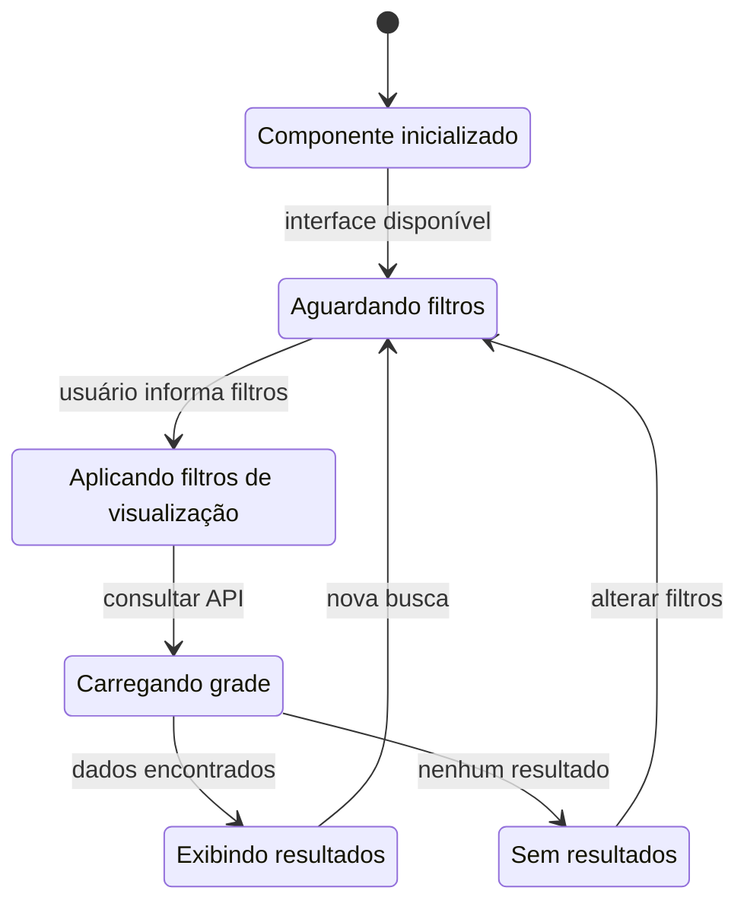
```mermaid
stateDiagram-v2
    [*] --> Inicializado
    Inicializado: Componente inicializado
    Inicializado --> AguardandoFiltros: interface disponível
    AguardandoFiltros: Aguardando filtros
    AguardandoFiltros --> AplicandoFiltrosVisualizacao: usuário informa filtros
    AplicandoFiltrosVisualizacao: Aplicando filtros de visualização
    AplicandoFiltrosVisualizacao --> CarregandoGrade: consultar API
    CarregandoGrade: Carregando grade
    CarregandoGrade --> ExibindoResultados: dados encontrados
    CarregandoGrade --> SemResultados: nenhum resultado
    ExibindoResultados: Exibindo resultados
    SemResultados: Sem resultados
    ExibindoResultados --> AguardandoFiltros: nova busca
    SemResultados --> AguardandoFiltros: alterar filtros
```

## Figura E11. Diagrama de Estados da classe `SalaService` para o [UC005]

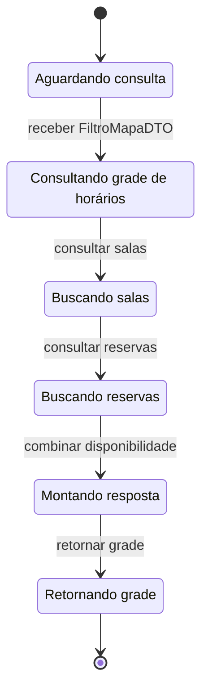
```mermaid
stateDiagram-v2
    [*] --> AguardandoConsulta
    AguardandoConsulta: Aguardando consulta
    AguardandoConsulta --> ConsultandoGradeHorarios: receber FiltroMapaDTO
    ConsultandoGradeHorarios: Consultando grade de horários
    ConsultandoGradeHorarios --> BuscandoSalas: consultar salas
    BuscandoSalas: Buscando salas
    BuscandoSalas --> BuscandoReservas: consultar reservas
    BuscandoReservas: Buscando reservas
    BuscandoReservas --> MontandoResposta: combinar disponibilidade
    MontandoResposta: Montando resposta
    MontandoResposta --> RetornandoGrade: retornar grade
    RetornandoGrade: Retornando grade
    RetornandoGrade --> [*]
```

---

## Figura E12. Diagrama de Estados da classe `FormProjetoComponent` para o [UC006]

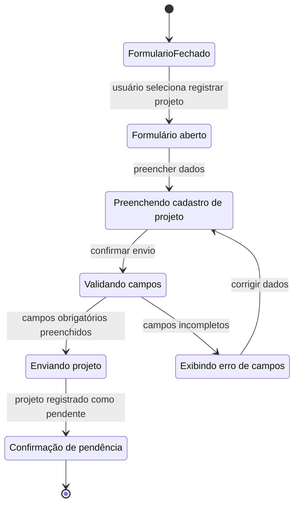
```mermaid
stateDiagram-v2
    [*] --> FormularioFechado
    FormularioFechado --> FormularioAberto: usuário seleciona registrar projeto
    FormularioAberto: Formulário aberto
    FormularioAberto --> PreenchendoCadastroProjeto: preencher dados
    PreenchendoCadastroProjeto: Preenchendo cadastro de projeto
    PreenchendoCadastroProjeto --> ValidandoCampos: confirmar envio
    ValidandoCampos: Validando campos
    ValidandoCampos --> EnviandoProjeto: campos obrigatórios preenchidos
    ValidandoCampos --> ExibindoErroCampos: campos incompletos
    EnviandoProjeto: Enviando projeto
    EnviandoProjeto --> ConfirmacaoPendente: projeto registrado como pendente
    ExibindoErroCampos: Exibindo erro de campos
    ExibindoErroCampos --> PreenchendoCadastroProjeto: corrigir dados
    ConfirmacaoPendente: Confirmação de pendência
    ConfirmacaoPendente --> [*]
```

## Figura E13. Diagrama de Estados da classe `ProjetoService` para o [UC006]

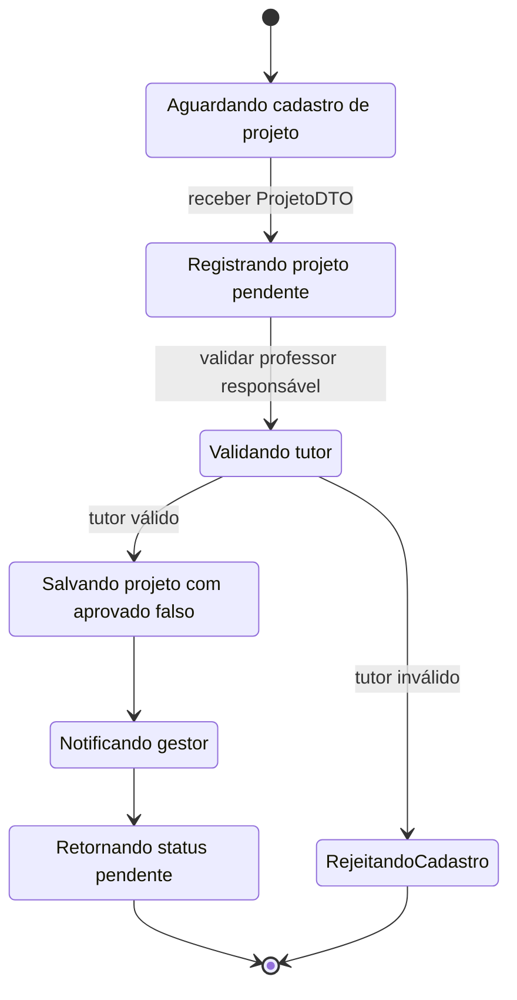
```mermaid
stateDiagram-v2
    [*] --> AguardandoCadastroProjeto
    AguardandoCadastroProjeto: Aguardando cadastro de projeto
    AguardandoCadastroProjeto --> RegistrandoProjetoPendente: receber ProjetoDTO
    RegistrandoProjetoPendente: Registrando projeto pendente
    RegistrandoProjetoPendente --> ValidandoTutor: validar professor responsável
    ValidandoTutor: Validando tutor
    ValidandoTutor --> SalvandoProjeto: tutor válido
    ValidandoTutor --> RejeitandoCadastro: tutor inválido
    SalvandoProjeto: Salvando projeto com aprovado falso
    SalvandoProjeto --> NotificandoGestor
    NotificandoGestor: Notificando gestor
    NotificandoGestor --> RetornandoPendente
    RetornandoPendente: Retornando status pendente
    RetornandoPendente --> [*]
    RejeitandoCadastro --> [*]
```

---

## Figura E14. Diagrama de Estados da classe `ProjetoPage` para o [UC007]

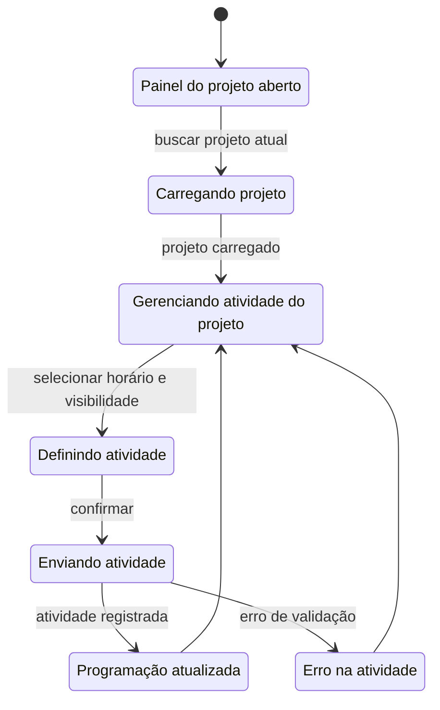
```mermaid
stateDiagram-v2
    [*] --> PainelProjetoAberto
    PainelProjetoAberto: Painel do projeto aberto
    PainelProjetoAberto --> CarregandoProjeto: buscar projeto atual
    CarregandoProjeto: Carregando projeto
    CarregandoProjeto --> GerenciandoAtividadeProjeto: projeto carregado
    GerenciandoAtividadeProjeto: Gerenciando atividade do projeto
    GerenciandoAtividadeProjeto --> DefinindoAtividade: selecionar horário e visibilidade
    DefinindoAtividade: Definindo atividade
    DefinindoAtividade --> EnviandoAtividade: confirmar
    EnviandoAtividade: Enviando atividade
    EnviandoAtividade --> ProgramacaoAtualizada: atividade registrada
    EnviandoAtividade --> ErroAtividade: erro de validação
    ProgramacaoAtualizada: Programação atualizada
    ErroAtividade: Erro na atividade
    ErroAtividade --> GerenciandoAtividadeProjeto
    ProgramacaoAtualizada --> GerenciandoAtividadeProjeto
```

## Figura E15. Diagrama de Estados da classe `ReservaService` para o [UC007]

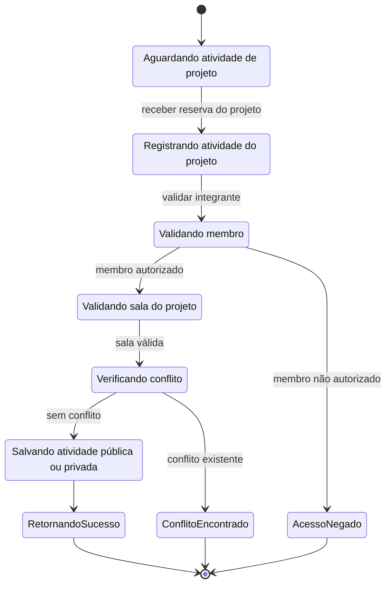
```mermaid
stateDiagram-v2
    [*] --> AguardandoAtividadeProjeto
    AguardandoAtividadeProjeto: Aguardando atividade de projeto
    AguardandoAtividadeProjeto --> RegistrandoAtividadeProjeto: receber reserva do projeto
    RegistrandoAtividadeProjeto: Registrando atividade do projeto
    RegistrandoAtividadeProjeto --> ValidandoMembro: validar integrante
    ValidandoMembro: Validando membro
    ValidandoMembro --> ValidandoSalaProjeto: membro autorizado
    ValidandoMembro --> AcessoNegado: membro não autorizado
    ValidandoSalaProjeto: Validando sala do projeto
    ValidandoSalaProjeto --> VerificandoConflitoProjeto: sala válida
    VerificandoConflitoProjeto: Verificando conflito
    VerificandoConflitoProjeto --> SalvandoAtividade: sem conflito
    VerificandoConflitoProjeto --> ConflitoEncontrado: conflito existente
    SalvandoAtividade: Salvando atividade pública ou privada
    SalvandoAtividade --> RetornandoSucesso
    RetornandoSucesso --> [*]
    AcessoNegado --> [*]
    ConflitoEncontrado --> [*]
```

---

## Figura E16. Diagrama de Estados da classe `HorariosLivresComponent` para o [UC008]

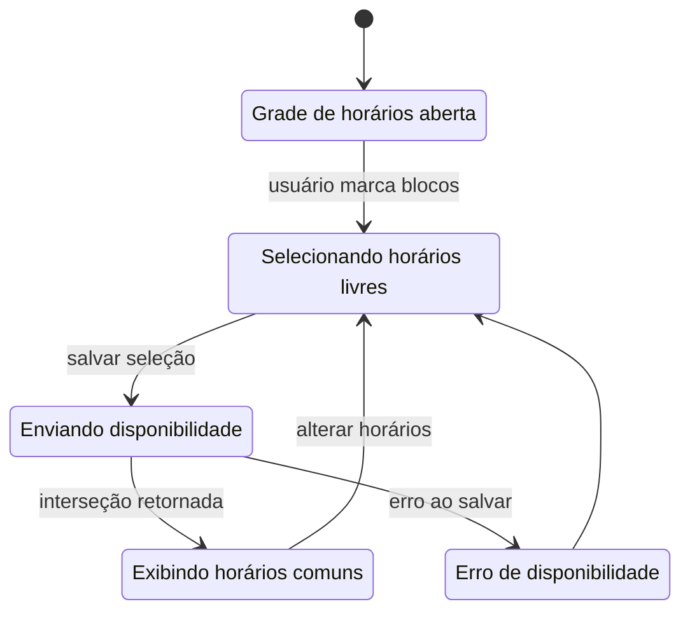
```mermaid
stateDiagram-v2
    [*] --> GradeAberta
    GradeAberta: Grade de horários aberta
    GradeAberta --> SelecionandoHorariosLivres: usuário marca blocos
    SelecionandoHorariosLivres: Selecionando horários livres
    SelecionandoHorariosLivres --> EnviandoDisponibilidade: salvar seleção
    EnviandoDisponibilidade: Enviando disponibilidade
    EnviandoDisponibilidade --> ExibindoIntersecao: interseção retornada
    EnviandoDisponibilidade --> ErroDisponibilidade: erro ao salvar
    ExibindoIntersecao: Exibindo horários comuns
    ErroDisponibilidade: Erro de disponibilidade
    ErroDisponibilidade --> SelecionandoHorariosLivres
    ExibindoIntersecao --> SelecionandoHorariosLivres: alterar horários
```

## Figura E17. Diagrama de Estados da classe `DisponibilidadeService` para o [UC008]

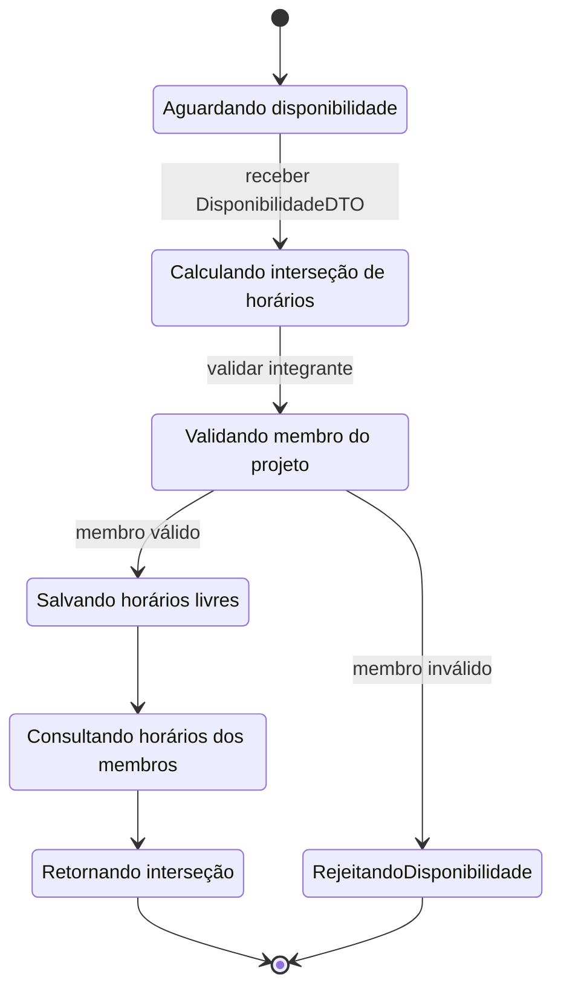
```mermaid
stateDiagram-v2
    [*] --> AguardandoDisponibilidade
    AguardandoDisponibilidade: Aguardando disponibilidade
    AguardandoDisponibilidade --> CalculandoIntersecaoHorarios: receber DisponibilidadeDTO
    CalculandoIntersecaoHorarios: Calculando interseção de horários
    CalculandoIntersecaoHorarios --> ValidandoMembroProjeto: validar integrante
    ValidandoMembroProjeto: Validando membro do projeto
    ValidandoMembroProjeto --> SalvandoHorarios: membro válido
    ValidandoMembroProjeto --> RejeitandoDisponibilidade: membro inválido
    SalvandoHorarios: Salvando horários livres
    SalvandoHorarios --> ConsultandoHorariosMembros
    ConsultandoHorariosMembros: Consultando horários dos membros
    ConsultandoHorariosMembros --> RetornandoIntersecao
    RetornandoIntersecao: Retornando interseção
    RetornandoIntersecao --> [*]
    RejeitandoDisponibilidade --> [*]
```

---

## Figura E18. Diagrama de Estados da classe `GestaoUsuariosPage` para o [UC009]

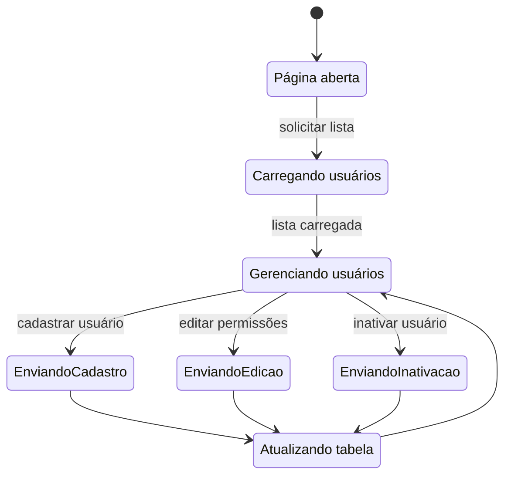
```mermaid
stateDiagram-v2
    [*] --> PaginaAberta
    PaginaAberta: Página aberta
    PaginaAberta --> CarregandoUsuarios: solicitar lista
    CarregandoUsuarios: Carregando usuários
    CarregandoUsuarios --> GerenciandoUsuarios: lista carregada
    GerenciandoUsuarios: Gerenciando usuários
    GerenciandoUsuarios --> EnviandoCadastro: cadastrar usuário
    GerenciandoUsuarios --> EnviandoEdicao: editar permissões
    GerenciandoUsuarios --> EnviandoInativacao: inativar usuário
    EnviandoCadastro --> AtualizandoTabela
    EnviandoEdicao --> AtualizandoTabela
    EnviandoInativacao --> AtualizandoTabela
    AtualizandoTabela: Atualizando tabela
    AtualizandoTabela --> GerenciandoUsuarios
```

## Figura E19. Diagrama de Estados da classe `UsuarioService` para o [UC009]

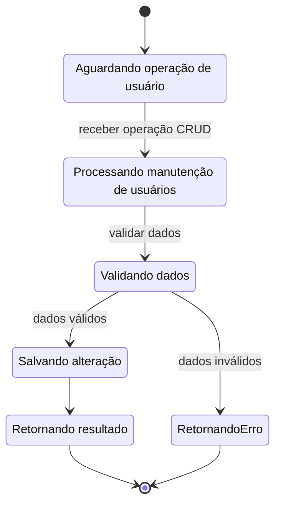
```mermaid
stateDiagram-v2
    [*] --> AguardandoOperacaoUsuario
    AguardandoOperacaoUsuario: Aguardando operação de usuário
    AguardandoOperacaoUsuario --> ProcessandoManutencaoUsuarios: receber operação CRUD
    ProcessandoManutencaoUsuarios: Processando manutenção de usuários
    ProcessandoManutencaoUsuarios --> ValidandoDadosUsuario: validar dados
    ValidandoDadosUsuario: Validando dados
    ValidandoDadosUsuario --> SalvandoUsuario: dados válidos
    ValidandoDadosUsuario --> RetornandoErro: dados inválidos
    SalvandoUsuario: Salvando alteração
    SalvandoUsuario --> RetornandoResultado
    RetornandoResultado: Retornando resultado
    RetornandoResultado --> [*]
    RetornandoErro --> [*]
```

---

## Figura E20. Diagrama de Estados da classe `GestaoSalasPage` para o [UC010]

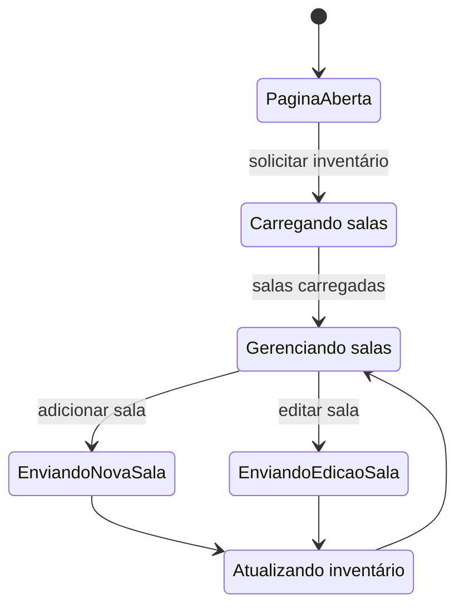
```mermaid
stateDiagram-v2
    [*] --> PaginaAberta
    PaginaAberta --> CarregandoSalas: solicitar inventário
    CarregandoSalas: Carregando salas
    CarregandoSalas --> GerenciandoSalas: salas carregadas
    GerenciandoSalas: Gerenciando salas
    GerenciandoSalas --> EnviandoNovaSala: adicionar sala
    GerenciandoSalas --> EnviandoEdicaoSala: editar sala
    EnviandoNovaSala --> AtualizandoInventario
    EnviandoEdicaoSala --> AtualizandoInventario
    AtualizandoInventario: Atualizando inventário
    AtualizandoInventario --> GerenciandoSalas
```

## Figura E21. Diagrama de Estados da classe `SalaService` para o [UC010]

```mermaid
stateDiagram-v2
    [*] --> AguardandoOperacaoSala
    AguardandoOperacaoSala: Aguardando operação de sala
    AguardandoOperacaoSala --> ProcessandoManutencaoSalas: receber operação CRUD
    ProcessandoManutencaoSalas: Processando manutenção de salas
    ProcessandoManutencaoSalas --> ValidandoDadosSala: validar bloco, código, capacidade e tipo
    ValidandoDadosSala: Validando dados da sala
    ValidandoDadosSala --> VerificandoDependencias: dados válidos
    ValidandoDadosSala --> RetornandoErro: dados inválidos
    VerificandoDependencias: Verificando dependências
    VerificandoDependencias --> SalvandoSala: manutenção permitida
    SalvandoSala: Salvando sala
    SalvandoSala --> RetornandoResultado
    RetornandoResultado --> [*]
    RetornandoErro --> [*]
```

---

## Figura E22. Diagrama de Estados da classe `GestaoDisciplinasPage` para o [UC011]

```mermaid
stateDiagram-v2
    [*] --> PaginaAberta
    PaginaAberta --> CarregandoDisciplinas: solicitar disciplinas
    CarregandoDisciplinas: Carregando disciplinas
    CarregandoDisciplinas --> GerenciandoDisciplinas: disciplinas carregadas
    GerenciandoDisciplinas: Gerenciando disciplinas
    GerenciandoDisciplinas --> EnviandoCadastroDisciplina: cadastrar disciplina
    GerenciandoDisciplinas --> EnviandoImportacaoDisciplina: importar lote
    GerenciandoDisciplinas --> EnviandoEdicaoDisciplina: editar disciplina
    EnviandoCadastroDisciplina --> AtualizandoTabela
    EnviandoImportacaoDisciplina --> AtualizandoTabela
    EnviandoEdicaoDisciplina --> AtualizandoTabela
    AtualizandoTabela: Atualizando tabela
    AtualizandoTabela --> GerenciandoDisciplinas
```

## Figura E23. Diagrama de Estados da classe `DisciplinaService` para o [UC011]

```mermaid
stateDiagram-v2
    [*] --> AguardandoOperacaoDisciplina
    AguardandoOperacaoDisciplina: Aguardando operação de disciplina
    AguardandoOperacaoDisciplina --> ProcessandoManutencaoDisciplinas: receber operação
    ProcessandoManutencaoDisciplinas: Processando manutenção de disciplinas
    ProcessandoManutencaoDisciplinas --> ValidandoProfessorDisciplina: validar professor e dados
    ValidandoProfessorDisciplina: Validando professor e disciplina
    ValidandoProfessorDisciplina --> SalvandoDisciplina: dados válidos
    ValidandoProfessorDisciplina --> RetornandoErro: dados inválidos
    SalvandoDisciplina: Salvando disciplina
    SalvandoDisciplina --> RetornandoResultado
    RetornandoResultado --> [*]
    RetornandoErro --> [*]
```

---

## Figura E24. Diagrama de Estados da classe `ProjetoPage` para o [UC012]

```mermaid
stateDiagram-v2
    [*] --> PainelProjetoAberto
    PainelProjetoAberto --> CarregandoMembros: carregar lista
    CarregandoMembros: Carregando membros
    CarregandoMembros --> GerenciandoMembrosProjeto: lista carregada
    GerenciandoMembrosProjeto: Gerenciando membros do projeto
    GerenciandoMembrosProjeto --> EnviandoAdicaoMembro: adicionar membro
    GerenciandoMembrosProjeto --> EnviandoRemocaoMembro: remover membro
    EnviandoAdicaoMembro --> AtualizandoLista
    EnviandoRemocaoMembro --> AtualizandoLista
    AtualizandoLista: Atualizando lista de membros
    AtualizandoLista --> GerenciandoMembrosProjeto
```

## Figura E25. Diagrama de Estados da classe `ProjetoService` para o [UC012]

```mermaid
stateDiagram-v2
    [*] --> AguardandoOperacaoMembro
    AguardandoOperacaoMembro: Aguardando operação de membro
    AguardandoOperacaoMembro --> AtualizandoVinculosMembros: receber adição ou remoção
    AtualizandoVinculosMembros: Atualizando vínculos de membros
    AtualizandoVinculosMembros --> ValidandoAdministradorProjeto: validar permissão
    ValidandoAdministradorProjeto: Validando administrador do projeto
    ValidandoAdministradorProjeto --> ValidandoUsuarioAlvo: administrador válido
    ValidandoAdministradorProjeto --> AcessoNegado: administrador inválido
    ValidandoUsuarioAlvo: Validando usuário alvo
    ValidandoUsuarioAlvo --> SalvandoVinculo: usuário válido
    ValidandoUsuarioAlvo --> RetornandoErro: usuário inválido
    SalvandoVinculo: Salvando vínculo
    SalvandoVinculo --> RetornandoResultado
    RetornandoResultado --> [*]
    RetornandoErro --> [*]
    AcessoNegado --> [*]
```
