# Diagramas Mermaid do Sistema S.O.L.

Arquivos gerados para complementar a documentação do projeto **S.O.L. — Sistema de Ocupação de Locais**.

Critério adotado: os diagramas foram baseados nos casos de uso, dicionário de classes e regras descritas no arquivo `PlanodoProjeto (1).md`. Para os diagramas de estados e atividades, foi seguido o padrão do grupo de referência: selecionar classes diretamente envolvidas em cada UC e detalhar o estado/atividade principal relacionado ao fluxo do caso de uso.

# Diagramas de Atividades por Estado Selecionado

---

## Figura A1. Diagrama de Atividades do estado “Aguardando autenticação de usuário” da classe `LoginPage` para o [UC001]

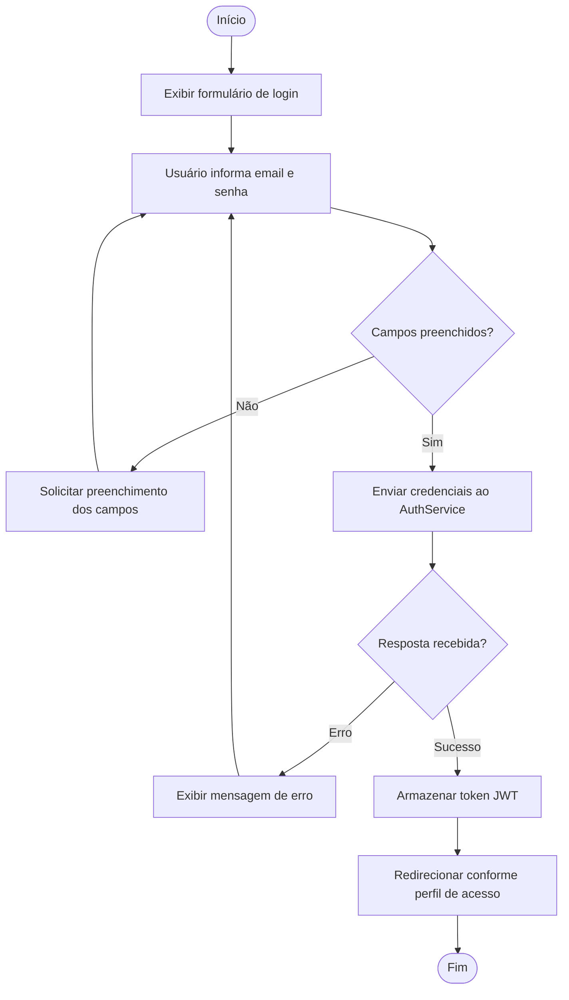
```mermaid
flowchart TD
    Inicio([Início]) --> A[Exibir formulário de login]
    A --> B[Usuário informa email e senha]
    B --> C{Campos preenchidos?}
    C -- Não --> D[Solicitar preenchimento dos campos]
    D --> B
    C -- Sim --> E[Enviar credenciais ao AuthService]
    E --> F{Resposta recebida?}
    F -- Erro --> G[Exibir mensagem de erro]
    G --> B
    F -- Sucesso --> H[Armazenar token JWT]
    H --> I[Redirecionar conforme perfil de acesso]
    I --> Fim([Fim])
```

## Figura A2. Diagrama de Atividades do estado “Realizando autenticação” da classe `UsuarioController` para o [UC001]

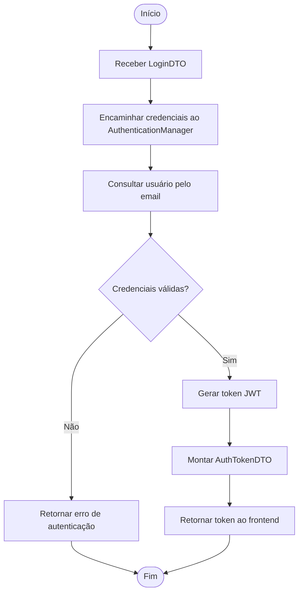
```mermaid
flowchart TD
    Inicio([Início]) --> A[Receber LoginDTO]
    A --> B[Encaminhar credenciais ao AuthenticationManager]
    B --> C[Consultar usuário pelo email]
    C --> D{Credenciais válidas?}
    D -- Não --> E[Retornar erro de autenticação]
    D -- Sim --> F[Gerar token JWT]
    F --> G[Montar AuthTokenDTO]
    G --> H[Retornar token ao frontend]
    E --> Fim([Fim])
    H --> Fim
```

---

## Figura A3. Diagrama de Atividades do estado “Preenchendo reserva diária” da classe `ModalReservaComponent` para o [UC002]

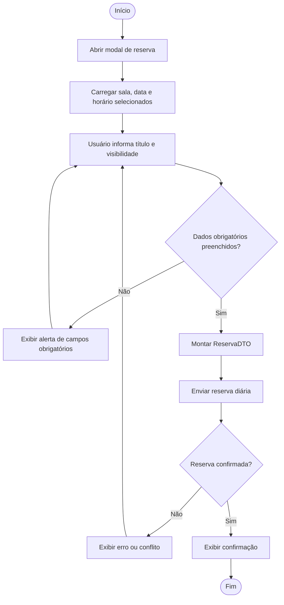
```mermaid
flowchart TD
    Inicio([Início]) --> A[Abrir modal de reserva]
    A --> B[Carregar sala, data e horário selecionados]
    B --> C[Usuário informa título e visibilidade]
    C --> D{Dados obrigatórios preenchidos?}
    D -- Não --> E[Exibir alerta de campos obrigatórios]
    E --> C
    D -- Sim --> F[Montar ReservaDTO]
    F --> G[Enviar reserva diária]
    G --> H{Reserva confirmada?}
    H -- Não --> I[Exibir erro ou conflito]
    I --> C
    H -- Sim --> J[Exibir confirmação]
    J --> Fim([Fim])
```

## Figura A4. Diagrama de Atividades do estado “Registrando reserva diária” da classe `ReservaService` para o [UC002]

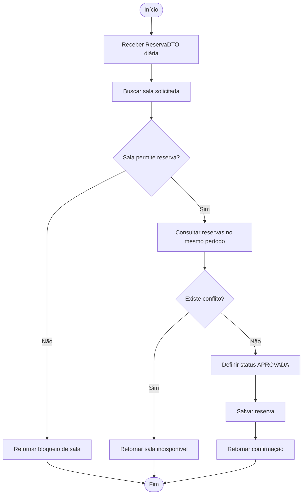
```mermaid
flowchart TD
    Inicio([Início]) --> A[Receber ReservaDTO diária]
    A --> B[Buscar sala solicitada]
    B --> C{Sala permite reserva?}
    C -- Não --> D[Retornar bloqueio de sala]
    C -- Sim --> E[Consultar reservas no mesmo período]
    E --> F{Existe conflito?}
    F -- Sim --> G[Retornar sala indisponível]
    F -- Não --> H[Definir status APROVADA]
    H --> I[Salvar reserva]
    I --> J[Retornar confirmação]
    D --> Fim([Fim])
    G --> Fim
    J --> Fim
```

---

## Figura A5. Diagrama de Atividades do estado “Preenchendo reserva semestral” da classe `ModalReservaComponent` para o [UC003]

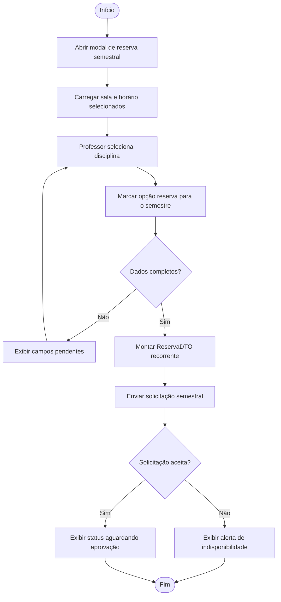
```mermaid
flowchart TD
    Inicio([Início]) --> A[Abrir modal de reserva semestral]
    A --> B[Carregar sala e horário selecionados]
    B --> C[Professor seleciona disciplina]
    C --> D[Marcar opção reserva para o semestre]
    D --> E{Dados completos?}
    E -- Não --> F[Exibir campos pendentes]
    F --> C
    E -- Sim --> G[Montar ReservaDTO recorrente]
    G --> H[Enviar solicitação semestral]
    H --> I{Solicitação aceita?}
    I -- Não --> J[Exibir alerta de indisponibilidade]
    I -- Sim --> K[Exibir status aguardando aprovação]
    J --> Fim([Fim])
    K --> Fim
```

## Figura A6. Diagrama de Atividades do estado “Gerando solicitação pendente” da classe `ReservaService` para o [UC003]

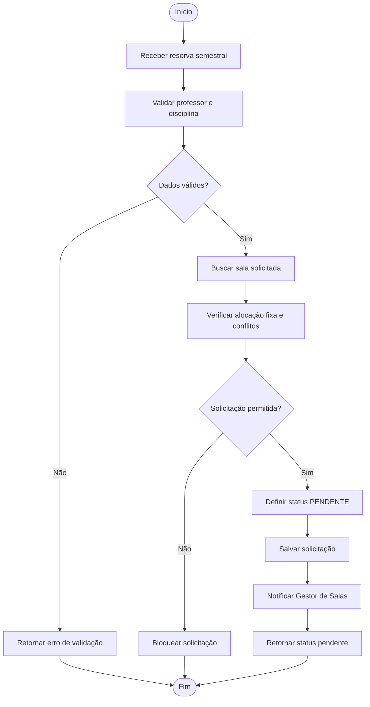
```mermaid
flowchart TD
    Inicio([Início]) --> A[Receber reserva semestral]
    A --> B[Validar professor e disciplina]
    B --> C{Dados válidos?}
    C -- Não --> D[Retornar erro de validação]
    C -- Sim --> E[Buscar sala solicitada]
    E --> F[Verificar alocação fixa e conflitos]
    F --> G{Solicitação permitida?}
    G -- Não --> H[Bloquear solicitação]
    G -- Sim --> I[Definir status PENDENTE]
    I --> J[Salvar solicitação]
    J --> K[Notificar Gestor de Salas]
    K --> L[Retornar status pendente]
    D --> Fim([Fim])
    H --> Fim
    L --> Fim
```

---

## Figura A7. Diagrama de Atividades do estado “Avaliando solicitação pendente” da classe `DashboardPage` para o [UC004]

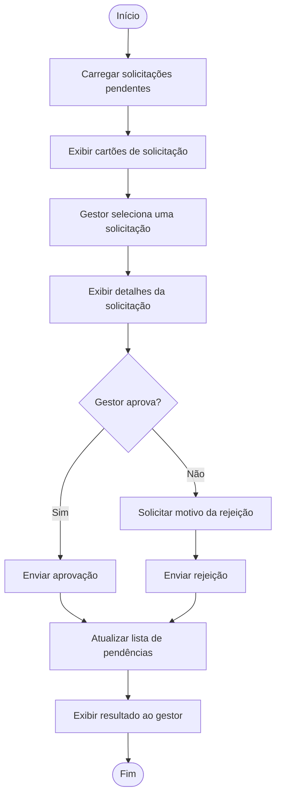
```mermaid
flowchart TD
    Inicio([Início]) --> A[Carregar solicitações pendentes]
    A --> B[Exibir cartões de solicitação]
    B --> C[Gestor seleciona uma solicitação]
    C --> D[Exibir detalhes da solicitação]
    D --> E{Gestor aprova?}
    E -- Sim --> F[Enviar aprovação]
    E -- Não --> G[Solicitar motivo da rejeição]
    G --> H[Enviar rejeição]
    F --> I[Atualizar lista de pendências]
    H --> I
    I --> J[Exibir resultado ao gestor]
    J --> Fim([Fim])
```

## Figura A8. Diagrama de Atividades do estado “Atualizando status da reserva” da classe `ReservaService` para o [UC004]

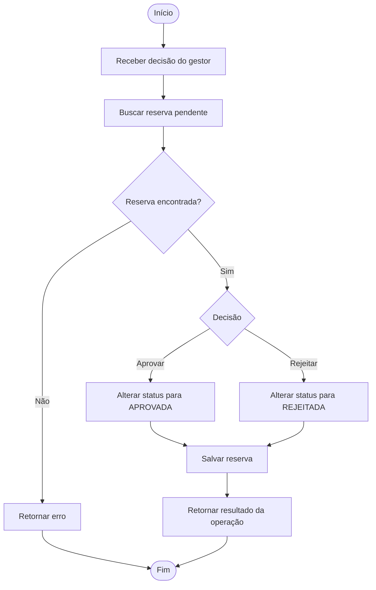
```mermaid
flowchart TD
    Inicio([Início]) --> A[Receber decisão do gestor]
    A --> B[Buscar reserva pendente]
    B --> C{Reserva encontrada?}
    C -- Não --> D[Retornar erro]
    C -- Sim --> E{Decisão}
    E -- Aprovar --> F[Alterar status para APROVADA]
    E -- Rejeitar --> G[Alterar status para REJEITADA]
    F --> H[Salvar reserva]
    G --> H
    H --> I[Retornar resultado da operação]
    D --> Fim([Fim])
    I --> Fim
```

## Figura A9. Diagrama de Atividades do estado “Atualizando status do projeto” da classe `ProjetoService` para o [UC004]

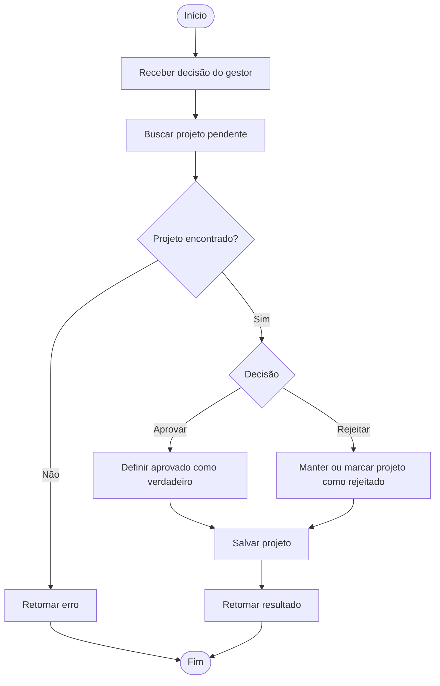
```mermaid
flowchart TD
    Inicio([Início]) --> A[Receber decisão do gestor]
    A --> B[Buscar projeto pendente]
    B --> C{Projeto encontrado?}
    C -- Não --> D[Retornar erro]
    C -- Sim --> E{Decisão}
    E -- Aprovar --> F[Definir aprovado como verdadeiro]
    E -- Rejeitar --> G[Manter ou marcar projeto como rejeitado]
    F --> H[Salvar projeto]
    G --> H
    H --> I[Retornar resultado]
    D --> Fim([Fim])
    I --> Fim
```

---

## Figura A10. Diagrama de Atividades do estado “Aplicando filtros de visualização” da classe `MapaComponent` para o [UC005]

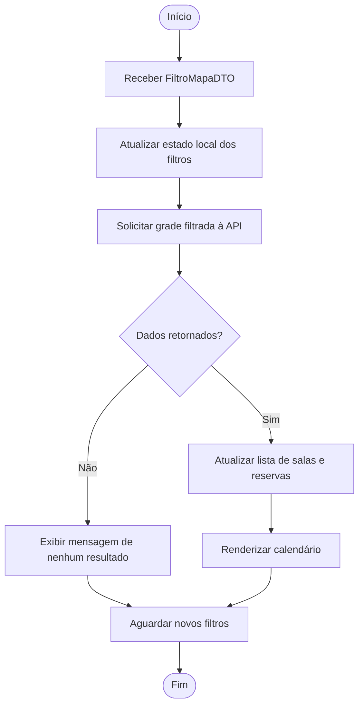
```mermaid
flowchart TD
    Inicio([Início]) --> A[Receber FiltroMapaDTO]
    A --> B[Atualizar estado local dos filtros]
    B --> C[Solicitar grade filtrada à API]
    C --> D{Dados retornados?}
    D -- Não --> E[Exibir mensagem de nenhum resultado]
    D -- Sim --> F[Atualizar lista de salas e reservas]
    F --> G[Renderizar calendário]
    E --> H[Aguardar novos filtros]
    G --> H
    H --> Fim([Fim])
```

## Figura A11. Diagrama de Atividades do estado “Consultando grade de horários” da classe `SalaService` para o [UC005]

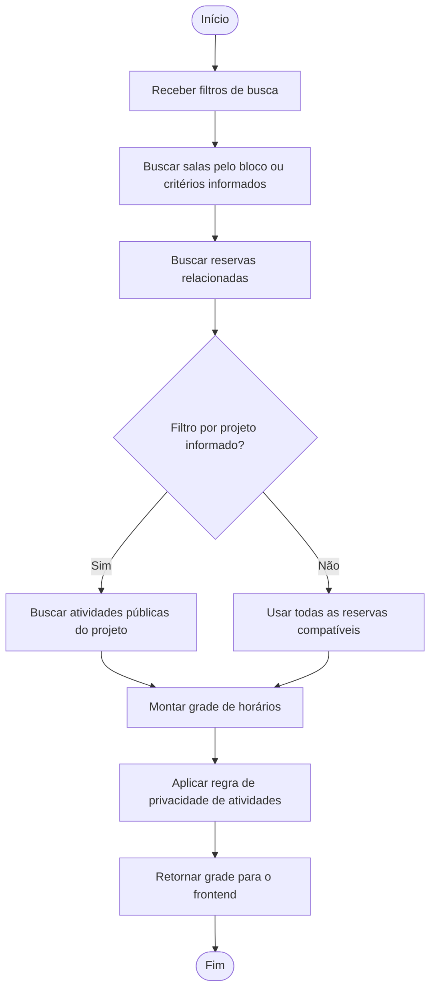
```mermaid
flowchart TD
    Inicio([Início]) --> A[Receber filtros de busca]
    A --> B[Buscar salas pelo bloco ou critérios informados]
    B --> C[Buscar reservas relacionadas]
    C --> D{Filtro por projeto informado?}
    D -- Sim --> E[Buscar atividades públicas do projeto]
    D -- Não --> F[Usar todas as reservas compatíveis]
    E --> G[Montar grade de horários]
    F --> G
    G --> H[Aplicar regra de privacidade de atividades]
    H --> I[Retornar grade para o frontend]
    I --> Fim([Fim])
```

---

## Figura A12. Diagrama de Atividades do estado “Preenchendo cadastro de projeto” da classe `FormProjetoComponent` para o [UC006]

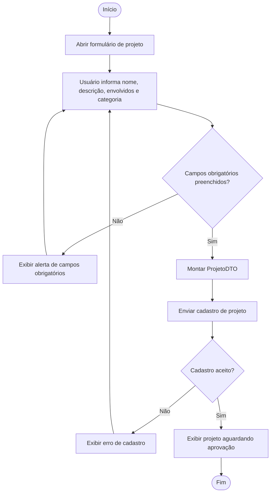
```mermaid
flowchart TD
    Inicio([Início]) --> A[Abrir formulário de projeto]
    A --> B[Usuário informa nome, descrição, envolvidos e categoria]
    B --> C{Campos obrigatórios preenchidos?}
    C -- Não --> D[Exibir alerta de campos obrigatórios]
    D --> B
    C -- Sim --> E[Montar ProjetoDTO]
    E --> F[Enviar cadastro de projeto]
    F --> G{Cadastro aceito?}
    G -- Não --> H[Exibir erro de cadastro]
    G -- Sim --> I[Exibir projeto aguardando aprovação]
    H --> B
    I --> Fim([Fim])
```

## Figura A13. Diagrama de Atividades do estado “Registrando projeto pendente” da classe `ProjetoService` para o [UC006]

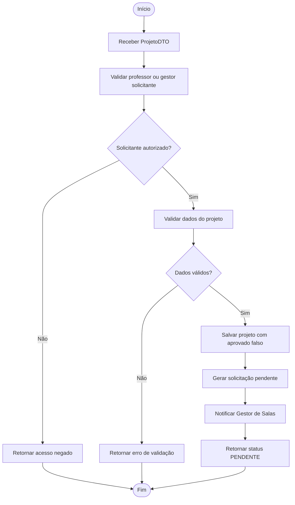
```mermaid
flowchart TD
    Inicio([Início]) --> A[Receber ProjetoDTO]
    A --> B[Validar professor ou gestor solicitante]
    B --> C{Solicitante autorizado?}
    C -- Não --> D[Retornar acesso negado]
    C -- Sim --> E[Validar dados do projeto]
    E --> F{Dados válidos?}
    F -- Não --> G[Retornar erro de validação]
    F -- Sim --> H[Salvar projeto com aprovado falso]
    H --> I[Gerar solicitação pendente]
    I --> J[Notificar Gestor de Salas]
    J --> K[Retornar status PENDENTE]
    D --> Fim([Fim])
    G --> Fim
    K --> Fim
```

---

## Figura A14. Diagrama de Atividades do estado “Gerenciando atividade do projeto” da classe `ProjetoPage` para o [UC007]

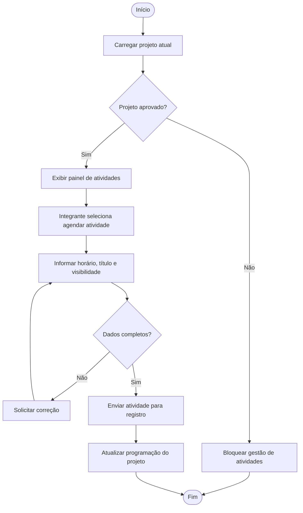
```mermaid
flowchart TD
    Inicio([Início]) --> A[Carregar projeto atual]
    A --> B{Projeto aprovado?}
    B -- Não --> C[Bloquear gestão de atividades]
    B -- Sim --> D[Exibir painel de atividades]
    D --> E[Integrante seleciona agendar atividade]
    E --> F[Informar horário, título e visibilidade]
    F --> G{Dados completos?}
    G -- Não --> H[Solicitar correção]
    H --> F
    G -- Sim --> I[Enviar atividade para registro]
    I --> J[Atualizar programação do projeto]
    C --> Fim([Fim])
    J --> Fim
```

## Figura A15. Diagrama de Atividades do estado “Registrando atividade do projeto” da classe `ReservaService` para o [UC007]

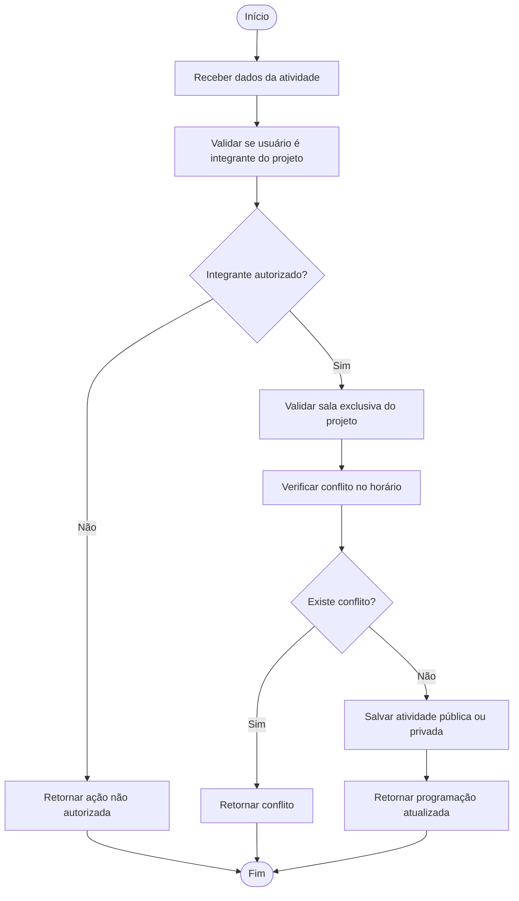
```mermaid
flowchart TD
    Inicio([Início]) --> A[Receber dados da atividade]
    A --> B[Validar se usuário é integrante do projeto]
    B --> C{Integrante autorizado?}
    C -- Não --> D[Retornar ação não autorizada]
    C -- Sim --> E[Validar sala exclusiva do projeto]
    E --> F[Verificar conflito no horário]
    F --> G{Existe conflito?}
    G -- Sim --> H[Retornar conflito]
    G -- Não --> I[Salvar atividade pública ou privada]
    I --> J[Retornar programação atualizada]
    D --> Fim([Fim])
    H --> Fim
    J --> Fim
```

---

## Figura A16. Diagrama de Atividades do estado “Selecionando horários livres” da classe `HorariosLivresComponent` para o [UC008]

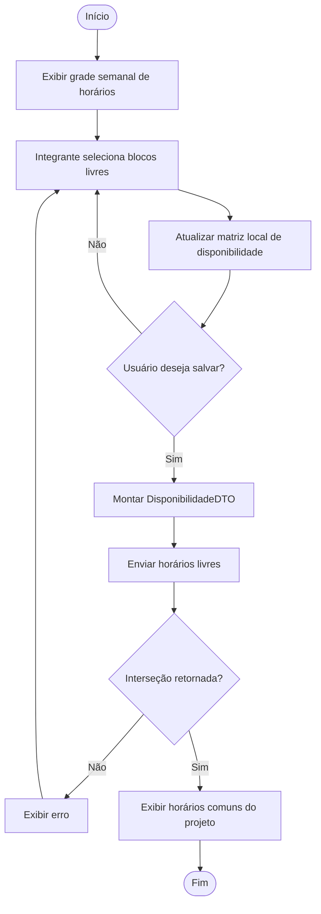
```mermaid
flowchart TD
    Inicio([Início]) --> A[Exibir grade semanal de horários]
    A --> B[Integrante seleciona blocos livres]
    B --> C[Atualizar matriz local de disponibilidade]
    C --> D{Usuário deseja salvar?}
    D -- Não --> B
    D -- Sim --> E[Montar DisponibilidadeDTO]
    E --> F[Enviar horários livres]
    F --> G{Interseção retornada?}
    G -- Não --> H[Exibir erro]
    G -- Sim --> I[Exibir horários comuns do projeto]
    H --> B
    I --> Fim([Fim])
```

## Figura A17. Diagrama de Atividades do estado “Calculando interseção de horários” da classe `DisponibilidadeService` para o [UC008]

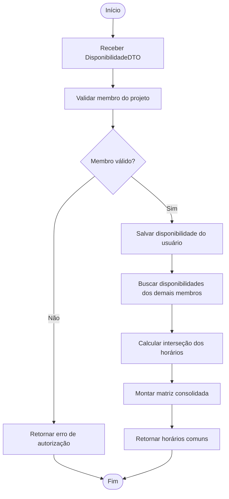
```mermaid
flowchart TD
    Inicio([Início]) --> A[Receber DisponibilidadeDTO]
    A --> B[Validar membro do projeto]
    B --> C{Membro válido?}
    C -- Não --> D[Retornar erro de autorização]
    C -- Sim --> E[Salvar disponibilidade do usuário]
    E --> F[Buscar disponibilidades dos demais membros]
    F --> G[Calcular interseção dos horários]
    G --> H[Montar matriz consolidada]
    H --> I[Retornar horários comuns]
    D --> Fim([Fim])
    I --> Fim
```

---

## Figura A18. Diagrama de Atividades do estado “Gerenciando usuários” da classe `GestaoUsuariosPage` para o [UC009]

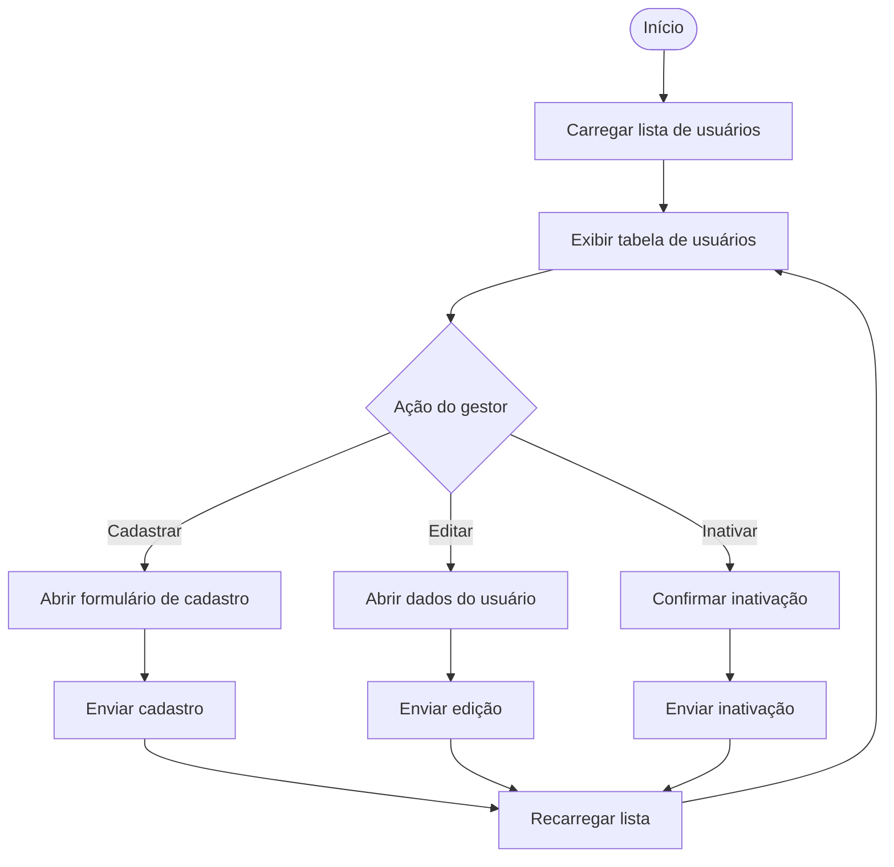
```mermaid
flowchart TD
    Inicio([Início]) --> A[Carregar lista de usuários]
    A --> B[Exibir tabela de usuários]
    B --> C{Ação do gestor}
    C -- Cadastrar --> D[Abrir formulário de cadastro]
    C -- Editar --> E[Abrir dados do usuário]
    C -- Inativar --> F[Confirmar inativação]
    D --> G[Enviar cadastro]
    E --> H[Enviar edição]
    F --> I[Enviar inativação]
    G --> J[Recarregar lista]
    H --> J
    I --> J
    J --> B
```

## Figura A19. Diagrama de Atividades do estado “Processando manutenção de usuários” da classe `UsuarioService` para o [UC009]

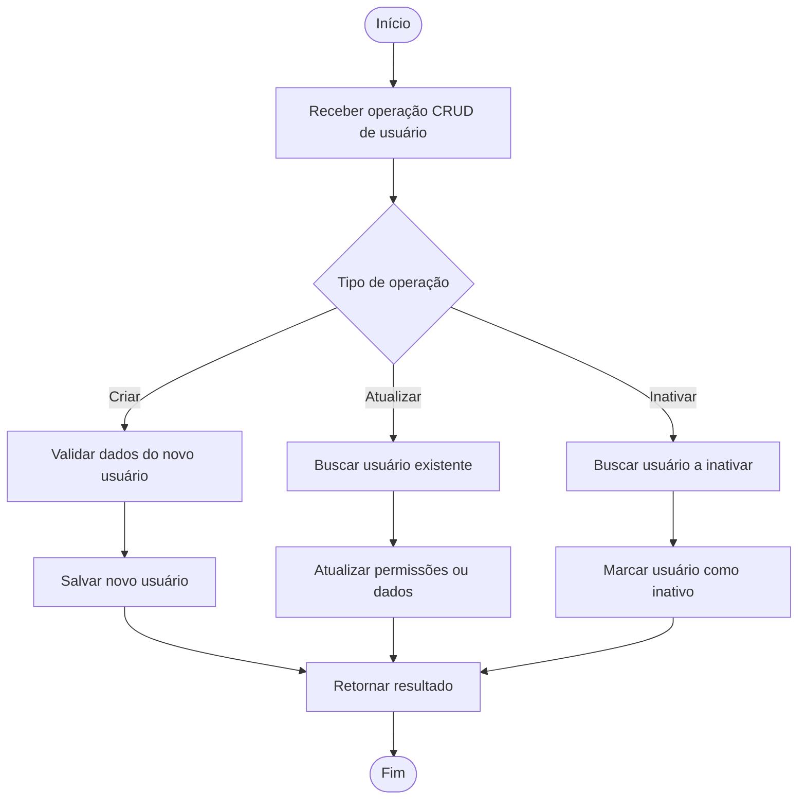
```mermaid
flowchart TD
    Inicio([Início]) --> A[Receber operação CRUD de usuário]
    A --> B{Tipo de operação}
    B -- Criar --> C[Validar dados do novo usuário]
    B -- Atualizar --> D[Buscar usuário existente]
    B -- Inativar --> E[Buscar usuário a inativar]
    C --> F[Salvar novo usuário]
    D --> G[Atualizar permissões ou dados]
    E --> H[Marcar usuário como inativo]
    F --> I[Retornar resultado]
    G --> I
    H --> I
    I --> Fim([Fim])
```

---

## Figura A20. Diagrama de Atividades do estado “Gerenciando salas” da classe `GestaoSalasPage` para o [UC010]

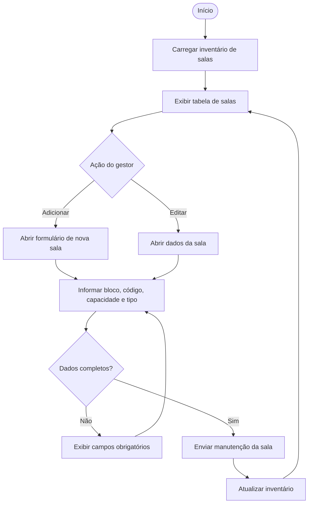
```mermaid
flowchart TD
    Inicio([Início]) --> A[Carregar inventário de salas]
    A --> B[Exibir tabela de salas]
    B --> C{Ação do gestor}
    C -- Adicionar --> D[Abrir formulário de nova sala]
    C -- Editar --> E[Abrir dados da sala]
    D --> F[Informar bloco, código, capacidade e tipo]
    E --> F
    F --> G{Dados completos?}
    G -- Não --> H[Exibir campos obrigatórios]
    H --> F
    G -- Sim --> I[Enviar manutenção da sala]
    I --> J[Atualizar inventário]
    J --> B
```

## Figura A21. Diagrama de Atividades do estado “Processando manutenção de salas” da classe `SalaService` para o [UC010]

```mermaid
flowchart TD
    Inicio([Início]) --> A[Receber operação de sala]
    A --> B[Validar bloco, código, capacidade e tipo]
    B --> C{Dados válidos?}
    C -- Não --> D[Retornar erro de validação]
    C -- Sim --> E{Operação altera sala existente?}
    E -- Sim --> F[Verificar dependências e reservas]
    E -- Não --> G[Preparar nova sala]
    F --> H[Salvar alterações da sala]
    G --> H
    H --> I[Retornar sala atualizada]
    D --> Fim([Fim])
    I --> Fim
```

---

## Figura A22. Diagrama de Atividades do estado “Gerenciando disciplinas” da classe `GestaoDisciplinasPage` para o [UC011]

```mermaid
flowchart TD
    Inicio([Início]) --> A[Carregar disciplinas do semestre]
    A --> B[Exibir tabela de disciplinas]
    B --> C{Ação do gestor}
    C -- Cadastrar --> D[Abrir formulário de disciplina]
    C -- Importar --> E[Selecionar lote de disciplinas]
    C -- Editar --> F[Abrir dados da disciplina]
    D --> G[Enviar dados da disciplina]
    E --> H[Enviar importação em lote]
    F --> I[Enviar edição]
    G --> J[Atualizar tabela]
    H --> J
    I --> J
    J --> B
```

## Figura A23. Diagrama de Atividades do estado “Processando manutenção de disciplinas” da classe `DisciplinaService` para o [UC011]

```mermaid
flowchart TD
    Inicio([Início]) --> A[Receber operação de disciplina]
    A --> B[Validar código, nome, semestre, turma e carga horária]
    B --> C[Validar professor vinculado]
    C --> D{Dados válidos?}
    D -- Não --> E[Retornar erro de validação]
    D -- Sim --> F{Operação}
    F -- Cadastro --> G[Salvar nova disciplina]
    F -- Importação --> H[Salvar lote de disciplinas]
    F -- Edição --> I[Atualizar disciplina existente]
    G --> J[Retornar resultado]
    H --> J
    I --> J
    E --> Fim([Fim])
    J --> Fim
```

---

## Figura A24. Diagrama de Atividades do estado “Gerenciando membros do projeto” da classe `ProjetoPage` para o [UC012]

```mermaid
flowchart TD
    Inicio([Início]) --> A[Carregar lista de membros do projeto]
    A --> B[Exibir seção de membros]
    B --> C{Ação do administrador}
    C -- Adicionar --> D[Selecionar usuário a adicionar]
    C -- Remover --> E[Selecionar membro a remover]
    D --> F[Enviar solicitação de adição]
    E --> G[Enviar solicitação de remoção]
    F --> H[Atualizar lista de membros]
    G --> H
    H --> B
```

## Figura A25. Diagrama de Atividades do estado “Atualizando vínculos de membros” da classe `ProjetoService` para o [UC012]

```mermaid
flowchart TD
    Inicio([Início]) --> A[Receber operação de membro]
    A --> B[Validar se solicitante é administrador do projeto]
    B --> C{Administrador válido?}
    C -- Não --> D[Retornar ação não autorizada]
    C -- Sim --> E[Buscar usuário alvo]
    E --> F{Usuário encontrado?}
    F -- Não --> G[Retornar erro de usuário]
    F -- Sim --> H{Operação}
    H -- Adicionar --> I[Criar vínculo MembroProjeto]
    H -- Remover --> J[Remover vínculo existente]
    I --> K[Salvar alteração]
    J --> K
    K --> L[Retornar lista atualizada]
    D --> Fim([Fim])
    G --> Fim
    L --> Fim
```
