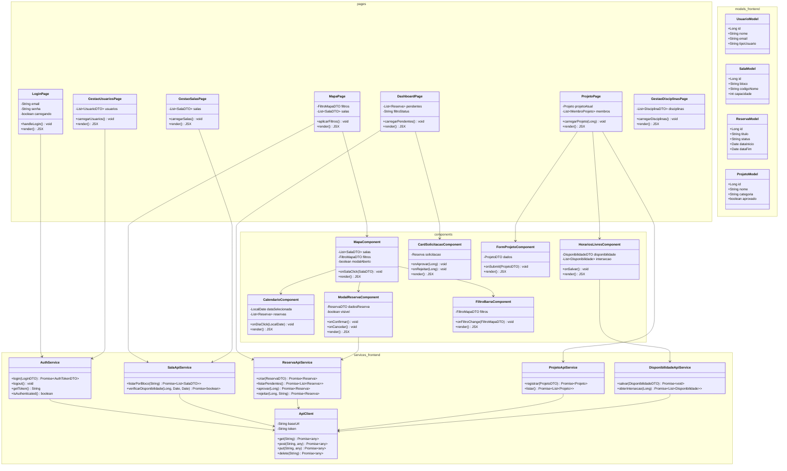

# Diagramas de Classes — Sistema SOL

> [!NOTE]
> Diagramas gerados com base na análise do `PlanodoProjeto.md`, seguindo o formato de referência do PDF (diagrama Backend separado do Frontend, organizados por pacotes/camadas).

---

## 1. Diagrama de Classes — Backend (Spring Boot)

```mermaid
classDiagram
    direction TB

    namespace model {
        class Usuario {
            -Long id
            -String nome
            -String email
            -String senhaHash
            -TipoUsuario tipoUsuario
            -LocalDate dataCriacao
            -boolean ativo
        }
        class Sala {
            -Long id
            -String bloco
            -String codigoNome
            -TipoSala tipoSala
            -int capacidade
            -boolean possuiProjetor
            -String descricao
            -boolean permiteReserva
        }
        class Reserva {
            -Long id
            -LocalDateTime dataInicio
            -LocalDateTime dataFim
            -boolean recorrente
            -StatusReserva status
            -Visibilidade visibilidade
            -String titulo
            -String descricao
        }
        class Projeto {
            -Long id
            -String nome
            -String descricao
            -CategoriaProjeto categoria
            -boolean aprovado
        }
        class Disciplina {
            -Long id
            -String codigo
            -String nome
            -String semestre
            -int cargaHoraria
            -String turma
        }
        class MembroProjeto {
            -Long id
            -LocalDate dataIngresso
        }
        class Disponibilidade {
            -Long id
            -DiaSemana diaSemana
            -LocalTime horaInicio
            -LocalTime horaFim
        }
    }

    namespace enums {
        class TipoUsuario {
            <<enumeration>>
            ALUNO
            PROFESSOR
            TUTOR
            GESTOR
        }
        class TipoSala {
            <<enumeration>>
            LABORATORIO
            AULA
            PROJETO
            DEPARTAMENTO
        }
        class StatusReserva {
            <<enumeration>>
            PENDENTE
            APROVADA
            REJEITADA
        }
        class Visibilidade {
            <<enumeration>>
            PUBLICA
            PRIVADA
        }
        class CategoriaProjeto {
            <<enumeration>>
            ENSINO
            PESQUISA
            EXTENSAO
            GESTAO
        }
        class DiaSemana {
            <<enumeration>>
            SEGUNDA
            TERCA
            QUARTA
            QUINTA
            SEXTA
            SABADO
        }
    }

    Reserva "*" --> "1" Sala : sala
    Reserva "*" --> "1" Usuario : solicitante
    Reserva "*" --> "0..1" Disciplina : disciplina
    Reserva "*" --> "0..1" Projeto : projeto
    Projeto "*" --> "1" Usuario : tutor
    Projeto "0..1" --> "0..1" Sala : salaExclusiva
    Disciplina "*" --> "1" Usuario : professor
    MembroProjeto "*" --> "1" Usuario : usuario
    MembroProjeto "*" --> "1" Projeto : projeto
    Disponibilidade "*" --> "1" Usuario : usuario
    Disponibilidade "*" --> "0..1" Projeto : projeto

    namespace repository {
        class UsuarioRepository {
            <<interface>>
            +findByEmail(String) Optional~Usuario~
            +findByTipoUsuario(TipoUsuario) List~Usuario~
        }
        class SalaRepository {
            <<interface>>
            +findByBloco(String) List~Sala~
            +findByPermiteReserva(boolean) List~Sala~
        }
        class ReservaRepository {
            <<interface>>
            +findBySalaAndData(Long, LocalDateTime, LocalDateTime) List~Reserva~
            +findByStatus(StatusReserva) List~Reserva~
            +findByUsuarioId(Long) List~Reserva~
        }
        class ProjetoRepository {
            <<interface>>
            +findByAprovado(boolean) List~Projeto~
            +findByTutorId(Long) List~Projeto~
        }
        class DisciplinaRepository {
            <<interface>>
            +findBySemestre(String) List~Disciplina~
            +findByProfessorId(Long) List~Disciplina~
        }
        class MembroProjetoRepository {
            <<interface>>
            +findByProjetoId(Long) List~MembroProjeto~
            +findByUsuarioId(Long) List~MembroProjeto~
        }
        class DisponibilidadeRepository {
            <<interface>>
            +findByUsuarioId(Long) List~Disponibilidade~
        }
    }

    UsuarioRepository ..> Usuario
    SalaRepository ..> Sala
    ReservaRepository ..> Reserva
    ProjetoRepository ..> Projeto
    DisciplinaRepository ..> Disciplina
    MembroProjetoRepository ..> MembroProjeto
    DisponibilidadeRepository ..> Disponibilidade

    namespace service {
        class UsuarioService {
            -UsuarioRepository usuarioRepository
            +cadastrar(Usuario) Usuario
            +buscarPorId(Long) Usuario
            +listarAtivos() List~Usuario~
            +atualizarPermissao(Long, TipoUsuario) void
            +inativar(Long) void
        }
        class SalaService {
            -SalaRepository salaRepository
            -ReservaRepository reservaRepository
            -int limiteCapacidadeDefault
            +listarPorBloco(String) List~Sala~
            +verificarDisponibilidade(Long, LocalDateTime, LocalDateTime) boolean
            +cadastrar(Sala) Sala
            +atualizar(Long, Sala) Sala
        }
        class ReservaService {
            -ReservaRepository reservaRepository
            -SalaRepository salaRepository
            +criarReserva(ReservaDTO) Reserva
            +aprovar(Long) Reserva
            +rejeitar(Long, String) Reserva
            +listarPendentes() List~Reserva~
            +listarPorUsuario(Long) List~Reserva~
        }
        class ProjetoService {
            -ProjetoRepository projetoRepository
            -MembroProjetoRepository membroRepo
            +registrar(ProjetoDTO) Projeto
            +aprovar(Long) Projeto
            +adicionarMembro(Long, Long) MembroProjeto
            +listarAprovados() List~Projeto~
        }
        class DisciplinaService {
            -DisciplinaRepository disciplinaRepository
            +cadastrar(Disciplina) Disciplina
            +listarPorSemestre(String) List~Disciplina~
            +importarLote(List~Disciplina~) void
        }
        class DisponibilidadeService {
            -DisponibilidadeRepository disponibilidadeRepo
            -MembroProjetoRepository membroProjetoRepo
            +salvarHorarios(Long, List~Disponibilidade~) void
            +calcularIntersecao(Long) List~Disponibilidade~
        }
    }

    UsuarioService --> UsuarioRepository
    SalaService --> SalaRepository
    SalaService --> ReservaRepository
    ReservaService --> ReservaRepository
    ReservaService --> SalaRepository
    ProjetoService --> ProjetoRepository
    ProjetoService --> MembroProjetoRepository
    DisciplinaService --> DisciplinaRepository
    DisponibilidadeService --> DisponibilidadeRepository
    DisponibilidadeService --> MembroProjetoRepository

    namespace controller {
        class UsuarioController {
            -UsuarioService usuarioService
            -AuthenticationManager authManager
            -JwtUtil jwtUtil
            +login(LoginDTO) AuthTokenDTO
            +listar() List~UsuarioDTO~
            +cadastrar(Usuario) UsuarioDTO
            +atualizar(Long, Usuario) UsuarioDTO
            +inativar(Long) void
        }
        class SalaController {
            -SalaService salaService
            +listarPorBloco(String) List~SalaDTO~
            +verificarDisponibilidade(Long, LocalDateTime, LocalDateTime) boolean
            +cadastrar(Sala) SalaDTO
            +atualizar(Long, Sala) SalaDTO
        }
        class ReservaController {
            -ReservaService reservaService
            +criar(ReservaDTO) Reserva
            +aprovar(Long) Reserva
            +rejeitar(Long, String) Reserva
            +listarPendentes() List~Reserva~
        }
        class ProjetoController {
            -ProjetoService projetoService
            +registrar(ProjetoDTO) Projeto
            +aprovar(Long) Projeto
            +listar() List~Projeto~
        }
        class DisciplinaController {
            -DisciplinaService disciplinaService
            +listar(String) List~Disciplina~
            +cadastrar(Disciplina) Disciplina
        }
        class DisponibilidadeController {
            -DisponibilidadeService disponibilidadeService
            +salvar(DisponibilidadeDTO) void
            +intersecao(Long) List~Disponibilidade~
        }
    }

    UsuarioController --> UsuarioService
    SalaController --> SalaService
    ReservaController --> ReservaService
    ProjetoController --> ProjetoService
    DisciplinaController --> DisciplinaService
    DisponibilidadeController --> DisponibilidadeService

    namespace dto {
        class LoginDTO {
            +String email
            +String senha
        }
        class AuthTokenDTO {
            +String token
            +LocalDateTime expiracao
        }
        class UsuarioDTO {
            +Long id
            +String nome
            +String email
            +TipoUsuario tipoUsuario
        }
        class SalaDTO {
            +Long id
            +String bloco
            +String codigoNome
            +int capacidade
        }
        class ReservaDTO {
            +Long idSala
            +Long idUsuario
            +LocalDateTime dataInicio
            +LocalDateTime dataFim
            +boolean recorrente
            +String titulo
            +Visibilidade visibilidade
        }
        class ProjetoDTO {
            +String nome
            +String descricao
            +CategoriaProjeto categoria
            +Long idTutor
        }
        class DisciplinaDTO {
            +String codigo
            +String nome
            +String semestre
        }
        class FiltroMapaDTO {
            +String bloco
            +LocalDate dataFoco
            +Long idProjeto
        }
        class DisponibilidadeDTO {
            +Long idUsuario
            +List~HorarioDTO~ matrizHorarios
        }
        class HorarioDTO {
            +DiaSemana diaSemana
            +LocalTime horaInicio
            +LocalTime horaFim
        }
    }

    namespace security {
        class JwtUtil {
            -String secret
            +gerarToken(Usuario) String
            +validarToken(String) boolean
            +extrairEmail(String) String
        }
    }

    UsuarioController --> JwtUtil
```

---

## 2. Diagrama de Classes — Frontend (React)

---

## 3. Análise Crítica e Alterações Sugeridas ao `PlanodoProjeto.md`

### 3.1 Classes/Entidades que estão corretas e bem definidas ✅

| Classe | Observação |
|---|---|
| `Usuario` | Completa e coerente |
| `Sala` | Completa e coerente |
| `Reserva` | Necessita ajuste menor (ver abaixo) |
| `Projeto` | Completa e coerente |
| `Disciplina` | Completa e coerente |
| `MembroProjeto` | Completa e coerente |
| `Disponibilidade` | Necessita ajuste menor (ver abaixo) |

### 3.2 Alterações a fazer no documento principal

> [!IMPORTANT]
> As seguintes alterações devem ser aplicadas ao `PlanodoProjeto.md`.

#### A) Entidade `Reserva` — Adicionar atributo `idProjeto`

A entidade `Reserva` atualmente possui `idDisciplina` para vincular reservas a disciplinas, mas **não possui `idProjeto`** para vincular reservas a projetos. Isso é essencial para os requisitos **[RF007]** e **[RF008]** (gerenciar sala e atividades de projeto).

**Ação:** Adicionar na tabela do Quadro 14 (Dicionário da Reserva):

| Atributo  | Descrição                                         | Tamanho | Tipo    | Formato  | Domínio  |
| --------- | ------------------------------------------------- | ------- | ------- | -------- | -------- |
| idProjeto | Referência ao projeto dono da reserva (opcional). | 10      | Integer | Numérico | Discreto |

---

#### B) Entidade `Disponibilidade` — Adicionar atributo `idProjeto`

A `Disponibilidade` atualmente só tem `idUsuario`, mas precisa de `idProjeto` para que a funcionalidade de interseção de horários (**[RF009]**) funcione corretamente por projeto.

**Ação:** Adicionar na tabela do Quadro 18:

| Atributo  | Tipo    | Tamanho | Descrição                                  | Domínio  |
| --------- | ------- | ------- | ------------------------------------------ | -------- |
| idProjeto | Integer | 4       | Chave estrangeira referenciando o Projeto. | Discreto |

---

#### C) Entidade `TipoSala` — Adicionar valor `PROJETO` e `DEPARTAMENTO`

O enum `TipoSala` atual só possui `LABORATORIO` e `AULA`. Para atender **[RP002]** (salas administrativas bloqueadas) e **[RF007]** (salas exclusivas de projeto), é necessário incluir:

**Ação:** No Quadro 13, alterar a descrição do atributo `tipoSala`:
- **De:** `Tipo de alocação (LABORATORIO, AULA).`
- **Para:** `Tipo de alocação (LABORATORIO, AULA, PROJETO, DEPARTAMENTO).`

---

#### D) Classes faltantes no documento — `SalaController` e `ReservaController`

O documento possui `UsuarioController`, `ProjetoController`, `DisciplinaController` e `DisponibilidadeController`, mas **faltam `SalaController` e `ReservaController`**, que são críticos para o funcionamento do sistema.

**Ação:** Criar dois novos quadros de Dicionário de Informações:

**SalaController:**

| Atributo    | Descrição                                              | Tamanho | Tipo        | Formato | Domínio |
| ----------- | ------------------------------------------------------ | ------- | ----------- | ------- | ------- |
| salaService | Injeção de dependência para regras de negócio de salas | N/A     | SalaService | Objeto  | N/A     |

**ReservaController:**

| Atributo       | Descrição                                                 | Tamanho | Tipo           | Formato | Domínio |
| -------------- | --------------------------------------------------------- | ------- | -------------- | ------- | ------- |
| reservaService | Injeção de dependência para regras de negócio de reservas | N/A     | ReservaService | Objeto  | N/A     |

---

#### E) Classes faltantes — `UsuarioService` e `ReservaService`

Na camada Service, o documento possui `SalaService`, `ProjetoService`, `DisciplinaService` e `DisponibilidadeService`, mas **faltam `UsuarioService` e `ReservaService`**.

**Ação:** Criar dois novos quadros:

**UsuarioService:**

| Atributo          | Descrição                                                | Tamanho | Tipo              | Formato | Domínio |
| ----------------- | -------------------------------------------------------- | ------- | ----------------- | ------- | ------- |
| usuarioRepository | Injeção do repositório para acesso aos dados de usuários | N/A     | UsuarioRepository | Objeto  | N/A     |

**ReservaService:**

| Atributo          | Descrição                                                  | Tamanho | Tipo              | Formato | Domínio |
| ----------------- | ---------------------------------------------------------- | ------- | ----------------- | ------- | ------- |
| reservaRepository | Injeção do repositório para acesso aos dados de reservas   | N/A     | ReservaRepository | Objeto  | N/A     |
| salaRepository    | Injeção do repositório para validação de conflitos de sala | N/A     | SalaRepository    | Objeto  | N/A     |

---

#### F) DTO faltante — `LoginDTO`

O documento possui `AuthTokenDTO` (resposta do login) mas **não possui `LoginDTO`** (payload de entrada com email e senha).

**Ação:** Criar novo quadro:

**LoginDTO:**

| Atributo | Descrição                              | Tamanho | Tipo   | Formato      | Domínio  |
| -------- | -------------------------------------- | ------- | ------ | ------------ | -------- |
| email    | Email institucional do usuário         | 80      | String | E-mail       | Contínuo |
| senha    | Senha em texto plano para autenticação | 255     | String | Alfanumérico | Contínuo |

---

#### G) DTO faltante — `HorarioDTO`

O `DisponibilidadeDTO` referencia `List<HorarioDTO>` no atributo `matrizHorarios`, mas **`HorarioDTO` não está definido** em nenhum lugar do documento.

**Ação:** Criar novo quadro:

**HorarioDTO:**

| Atributo   | Descrição                      | Tamanho | Tipo      | Formato | Domínio  |
| ---------- | ------------------------------ | ------- | --------- | ------- | -------- |
| diaSemana  | Dia da semana                  | 10      | Enum      | Texto   | Discreto |
| horaInicio | Hora de início do bloco livre  | 5       | LocalTime | HH:mm   | Contínuo |
| horaFim    | Hora de término do bloco livre | 5       | LocalTime | HH:mm   | Contínuo |

---

#### H) Atributos do `ReservaDTO` — Adicionar `titulo` e `visibilidade`

Para atender **[RF008]** (atividades públicas/privadas), o `ReservaDTO` precisa transportar esses dados.

**Ação:** Adicionar ao Quadro 28:

| Atributo     | Descrição                                  | Tamanho | Tipo   | Formato      | Domínio  |
| ------------ | ------------------------------------------ | ------- | ------ | ------------ | -------- |
| titulo       | Nome da atividade sendo reservada          | 80      | String | Alfanumérico | Contínuo |
| visibilidade | Indica se a atividade é PUBLICA ou PRIVADA | 20      | Enum   | Texto        | Discreto |

---

### 3.3 Resumo das Alterações

| # | Tipo | Classe | Ação |
|---|---|---|---|
| A | Modificar | `Reserva` | Adicionar `idProjeto` |
| B | Modificar | `Disponibilidade` | Adicionar `idProjeto` |
| C | Modificar | `Sala.tipoSala` | Adicionar `PROJETO`, `DEPARTAMENTO` ao enum |
| D | **Criar** | `SalaController`, `ReservaController` | Novos dicionários |
| E | **Criar** | `UsuarioService`, `ReservaService` | Novos dicionários |
| F | **Criar** | `LoginDTO` | Novo dicionário |
| G | **Criar** | `HorarioDTO` | Novo dicionário |
| H | Modificar | `ReservaDTO` | Adicionar `titulo`, `visibilidade` |

> [!TIP]
> Nenhuma classe existente precisa ser **excluída**. A modelagem atual é sólida; as lacunas são apenas de classes faltantes nas camadas Controller, Service e DTO, e ajustes pontuais em atributos para cobrir todos os requisitos funcionais.
